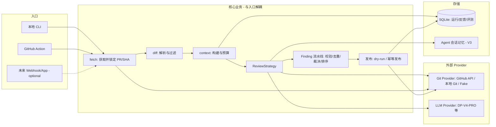

# 00 — Executive Summary

> 定位 / 价值 / 范围 / 核心取舍。给决策者与后续开发者 5 分钟建立全局认知。
> 本文件是 17 份架构文档（00–16）的入口；所有文档共用 `14-open-questions.md` 中登记的开放问题与附录 A 术语表。

---

## 1. 项目定位

**RepoSage** 是一个 GitHub PR 智能代码审查系统：

> 理解本次代码变更，按风险选择审查视角，必要时主动读取仓库上下文并验证证据，最终发布可定位、可解释、可处理的审查意见。

它不是：

```text
diff → 一个大 Prompt → 一段自由文本
```

而是：

```text
PR 事件/CLI → 获取并锁定 base/head SHA → 解析 diff、过滤文件、规划任务
→ 构建初始上下文 → 固定审查 / 多角色审查 / Agent 主动取证
→ 统一生成 Finding → 校验、合并、去重、裁决、排序
→ dry-run 或幂等发布到 GitHub → 保存覆盖、成本、轨迹、失败与反馈
```

## 2. 一句话价值

- **对使用者**：PR 级别的高质量行内评论，每条意见可定位（文件+行）、可解释（触发场景+影响+证据）、可处理（修复方向），且默认只读、dry-run 先行、重复运行不刷屏。
- **对开发者（本项目本人）**：一条从"简单固定链路"到"自主工具型 Agent"的渐进实现路线，每一版可运行、可测试、可演示、可评测，与之前的"文档生成 Agent"形成明显差异（Git 工作流、真实代码理解、结构化输出、工具调用、安全与评测）。

## 3. 交付范围（本仓库本轮产出）

本轮**只交付设计文档**（`docs/architecture/00–14`），不创建代码仓库、不安装依赖、不创建 GitHub App、不调用外部服务。设计文档之间相互一致，术语统一（见附录 A），可作为后续拆任务编码的依据。

## 4. 系统是什么（最终形态）



依赖方向：**入口 → 核心业务 → Provider/存储**；`domain/` 层不依赖任何 Provider。

## 5. 三阶段能力与落点

| 版本 | 核心能力 | 架构形态 | 演示要点 |
|------|----------|----------|----------|
| **V1 now** | diff 解析 → 单通用 reviewer → 严格 Finding → dry-run/发布 | 固定 SinglePass 链路，异步 I/O | 本地仓库 dry-run 出摘要+行内评论计划；成本/覆盖记录 |
| **V2 later** | 条件化多角色并发 + 符号级上下文 + 静态分析 + 去重/Judge + 反馈记忆 | MultiRoleReviewer（角色注册表+门控+barrier） | 高价值角色子集（security/silent-failure 等），成本对照 |
| **V3 later** | 只读工具 + Agent event loop + 证据验证 + 会话压缩 | AgenticReviewer（受控工具，任务级有限并发） | 跨文件取证闭环；评测证明相对 V2 的收益 |
| **v1.0.0** | GitHub Action、完整评测、安全加固、文档与演示 | 产品化入口 | 演示仓库线上冒烟 |

演进原则：**入口、领域模型、Provider、发布层不随版本重写**；版本差异只体现在 `ReviewStrategy` 的具体实现与上下文装配方式上（详见 `03` / `04`）。

## 6. 核心取舍（Tension 与决策）

| 取舍 | 决策 | 代价/缓解 |
|------|------|-----------|
| Agent 感 vs 确定性 | 程序验证路径/行号/证据；模型只提交候选 | Agent 能力受限，但可评测、可安全发布 |
| 成本 vs 质量 | 角色按确定性门控启用；超大 PR 降级并披露 | 部分 PR 覆盖不全，用覆盖清单披露 |
| 自研 vs 框架 | 首期不用 LangChain/LangGraph；自己实现 loop | 代码量增加，但可控、可测、可解释（见 `03` §7） |
| 通用 vs 专精 | 首发只审查 Python，架构允许扩展语言 | 初期覆盖面窄，换取深度与可评测 |
| tool calling 依赖 | 不假设 DP-V4-PRO 支持；双方案（换模型 / 受限 Action JSON） | V3 可能多一次适配工作（见 `08` §9、`09` §4） |
| 本地优先 | 第一入口 CLI + 本地 Token，dry-run 默认 | 暂不具备多用户产品形态，属预期 |

## 7. 关键数字（设计初值，须实测校准）

- 上下文 Token 预算：32,000（diff 40% / 相关代码 25% / 规则与反馈 10% / 余量 25%）
- 并发：文件任务 3、模型请求 3、GitHub 请求 5
- Agent：max_rounds 8、max_tool_calls 12（V3）
- 硬预算：总 Token 80,000、费用 $2.0、墙钟 600s
- 发布：默认 dry-run、幂等、request_changes 关闭

以上数值依据 `附录 B` 初值，最终以 DP-V4-PRO 实测与评测结果调整（见 `14-open-questions.md`）。

## 8. 主要风险（详见 `12` §7）

1. DP-V4-PRO 的 JSON/tool calling 能力不达标 → 降级路径已设计。
2. 误报率过高损害信任 → 置信度门控 + 反馈记忆 + 评测迭代。
3. V3 收益无法量化 → 跨文件评测样本必须先行设计。
4. 个人项目规模下引入过度基础设施 → 非目标清单（见 `01` §4）硬约束。

## 9. 文档地图

| 文档 | 内容 | 读者 |
|------|------|------|
| `01-prd.md` | 需求与成功指标 | 所有人 |
| `02-system-context.md` | 边界与外部依赖 | 架构 |
| `03-container-component-architecture.md` | 模块与目录 | 开发者 |
| `04-runtime-flows.md` | 时序、异步、状态机、失败流 | 开发者 |
| `05-domain-data-design.md` | 领域模型与 Finding 生命周期 | 开发者 |
| `06-context-memory-knowledge.md` | 上下文、记忆、知识、缓存 | 开发者 |
| `07-review-quality-pipeline.md` | 角色、门控、聚合、Judge、发布 | 开发者 |
| `08-tools-agent-runtime.md` | 工具 Schema 与 Agent loop | V3 开发者 |
| `09-prompts-models-config.md` | Prompt、模型适配、配置 | 开发者 |
| `10-security-reliability.md` | 威胁模型与可靠性 | 安全 |
| `11-observability-evaluation-testing.md` | 可观测、评测、测试、验收 | QA/开发者 |
| `12-roadmap-adrs.md` | 里程碑、任务、ADR、Git 规划 | PM/开发者 |
| `13-competitor-learning-map.md` | 四个参考项目映射 | 架构 |
| `14-open-questions.md` | 待确认/待实测清单 | 所有人 |
| `15-revision-notes.md` | 第一轮审查修订说明（P0/P1 逐条回应） | 架构 |
| `16-revision-notes-round2.md` | 第二轮审查修订说明（P0-R2/P1-R2 定点修订） | 架构 |
