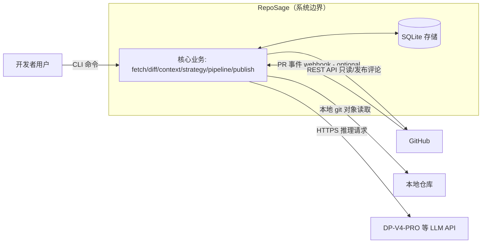

# 02 — 系统上下文与 C4 Context

> 系统边界、参与者、入口、外部依赖与 C4 Context 图。
> 标注：`V1 now` / `V2 later` / `V3 later` / `optional`。

---

## 1. 系统边界

RepoSage 是一个**本地优先、单进程、异步**的代码审查系统：

- 它是一个**审查工具**，不是代码托管平台、不是 CI 系统、不是编辑器插件（后两者均为 optional 接入点）。
- 它对仓库与 PR **默认只读**：读取本地 Git 或 GitHub API；写操作仅发生在显式 `--publish` 且校验通过之后，且只写评论/摘要，不修改代码。
- 它的"记忆"落在本地 SQLite；不依赖任何远程服务即可完整运行（模型 API 除外，dry-run 同样需要模型推理）。
- **C4 标注（本轮收敛）**：下图为**逻辑组件图**——同进程内的模块（核心业务、存储访问）不是独立 Container；真正的 Container 是 CLI/Action runner、RepoSage 进程、SQLite、GitHub、LLM API。

## 2. 参与者（Actor）

| 参与者 | 角色 | 交互 |
|--------|------|------|
| 开发者用户 | 主用户 | CLI 发起审查、确认发布、标记误报 |
| GitHub（平台） | 数据源/发布目标 | 提供 PR、diff、评论接口；Action 触发 |
| 本地仓库 | 数据源 | 供本地 Git 读取（无需网络时仍可用） |
| LLM API（DP-V4-PRO） | 推理服务 | 生成 Finding/摘要/角色输出 |
| 评测员（本项目） | 质量把关 | 运行评测集、对照实验 |
| 未来管理员/团队 | 配置与反馈 | 仓库规则、反馈记忆管理（V2 later） |

## 3. 入口（Entry Point）

| 入口 | 版本 | 说明 | 与核心业务的耦合 |
|------|------|------|------------------|
| 本地 CLI（Typer） | V1 now | 主入口；参数：`--pr` / `--base --head`、`--publish`、`--config` 等 | 只做参数解析 → 调 `app.service`，无业务逻辑 |
| GitHub Action | v1.0.0 | YAML workflow，事件触发，复用同一 `app` 入口 | 只做环境/输入映射 |
| Webhook / GitHub App | optional | 产品化形态，安装 Token、多仓库服务 | 复用核心，新增鉴权与事件分发 |
| Python API | optional | 供评测 runner 直接调用核心 | 评测/测试使用 |

## 4. 外部依赖与信任边界

| 依赖 | 用途 | 信任等级 | 约束 |
|------|------|----------|------|
| GitHub REST API | 拉 PR/diff、发评论、读 Issue | **半可信数据源**：PR 内容（描述/评论/文件）视为不可信数据（见 `10` §3） | 只读默认；评论写入幂等；Token 最小权限 |
| 本地 Git | 对象读取、diff、符号定位 | **按来源与 ref 分类**（P1-8）：系统配置/默认分支受信任规则可信；**待审 PR 的 checkout 内容与 GitHub PR 同权——不可信数据** | 禁止字符串拼 shell（见 `10` §4） |
| DP-V4-PRO（OpenAI-compatible） | 模型推理 | **不可信推理体**：输出必须程序验证 | 统一 Provider 抽象；能力需实测（见 `09` §3） |
| 静态分析器（ruff 等） | 高价值静态规则（V2） | 半可信：结果视为候选证据 | 转换进统一 Finding，来源标记 |
| SQLite | 运行/反馈/评测存储 | 可信（程序写入） | 本地文件，含隐私数据需脱敏（见 `10` §10） |
| 外部 MCP 工具（optional） | 可降级扩展工具 | 不可信 | 结果须截断+来源标记+沙箱（见 `08` §8） |

## 5. 关键外部接口契约（先定契约，实现后填）

| 接口 | 方向 | 契约要点 | 版本 |
|------|------|----------|------|
| `GitProvider.get_changes(ref) -> ChangeRequest` | 出 | 返回变更元数据 + 锁定 SHA（github_pr / local_range） | V1 |
| `GitProvider.get_diff(base, head, files?) -> Diff` | 出 | unified diff 原始文本 + 元数据 | V1 |
| `GitProvider.publish_comments(plan) -> PublishResult` | 出 | 幂等计划标识、失败明细 | V1 |
| `LLMProvider.complete(messages, schema?) -> ModelResponse` | 出 | 结构化输出或 JSON+重试降级 | V1 |
| `LLMProvider.tool_loop(session, tools) -> ...` | 出 | 仅 V3 启用；能力需实测 | V3 |
| `Storage.record_run(...)` 等 | 入 | SQLite 概念模型见 `05` §6 | V1 |

> 接口签名是伪代码级契约，实际实现以 `05` 领域模型为基准，禁止把 GitHub SDK 类型泄漏进 domain。

## 6. 边界内/外（最终形态）

**边界内**：PR 获取与锁定、diff 解析与过滤、上下文构建、策略化审查（SinglePass/MultiRole/Agentic）、Finding 流水线、发布（dry-run/幂等）、三类记忆、可观测、评测。

**边界外**：代码托管平台其余功能、CI 构建执行、自动改码提交、跨仓库代码图谱、多 Agent 协作、模型训练。

## 7. 演进（版本间边界不变）

- V1 now：只有 CLI 入口、GitHub/本地 Git Provider、单 LLM 调用、SQLite。
- V2 later：新增角色 registry、静态分析器、反馈记忆入口（CLI/评论指令）；入口不变。
- V3 later：新增 tools/ 只读工具与 Agent runtime；入口不变。
- v1.0.0：新增 GitHub Action 入口与线上冒烟；边界不变。

系统边界在三个版本中**保持稳定**——新增的都是内部组件，不是新边界。
