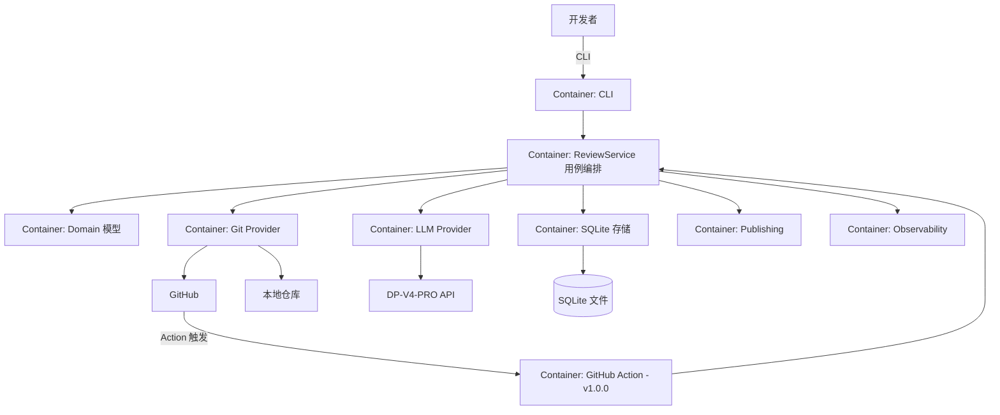
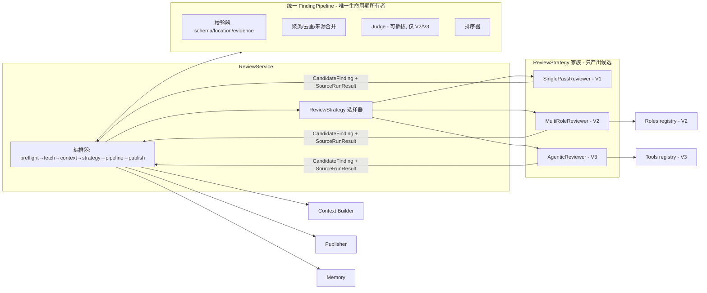

# 03 — 容器与组件架构

> 最终模块分层、依赖方向、目录结构、C4 Container/Component，以及"为什么不用 LangChain"论证。
> 标注：`V1 now` / `V2 later` / `V3 later` / `optional`。

---

## 1. 总体分层与依赖方向

```text
┌─────────────────────────────────────────────────────────┐
│ Entry（可替换，不承载业务）                                │
│   cli (Typer) · action (v1.0.0) · webhook/app (optional) │
├─────────────────────────────────────────────────────────┤
│ Application Services（用例编排：ReviewService, Publish…）  │
├─────────────────────────────────────────────────────────┤
│ Review（策略与流水线）                                    │
│   context · reviewers/roles · pipeline · agent(V3)       │
├─────────────────────────────────────────────────────────┤
│ Domain（纯模型：无 IO、无 SDK 依赖）                       │
│   pr/diff/finding/run/… + 枚举 + 策略接口                 │
├─────────────────────────────────────────────────────────┤
│ Providers（IO 适配，实现 Domain 接口）                     │
│   git(github/local/fake) · llm(dp-v4-pro/fake)           │
├─────────────────────────────────────────────────────────┤
│ Infra（可替换）                                           │
│   storage(sqlite) · publishing · observability · config  │
└─────────────────────────────────────────────────────────┘
```

**禁止的依赖方向**（编译期/静态检查强制）：

- `domain/` 不得 import：`httpx`、`requests`、GitHub SDK、`openai` 等；只能依赖 stdlib + Pydantic。
- `review/` 不得依赖具体 Provider 实现（GitHub API 类、具体模型类），只依赖 `domain` 定义的抽象接口。
- `providers/` 不得反向依赖 `review/` 内部细节；只产出 `domain` 对象。
- `entry/` 不得包含业务逻辑，只做参数 → 服务调用 → 输出格式化。

## 2. 目录结构（最终形态，标注版本）

```text
reposage/
├── app/                      # 入口层
│   ├── cli.py                #   V1 now   Typer CLI
│   ├── action/               #   v1.0.0   GitHub Action 入口（解析 event 输入）
│   └── webhook/              #   optional GitHub App/Webhook
├── domain/                   # 纯领域模型（见 05）
│   ├── models.py             #   PR、CommitRef、ChangedFile、Diff…
│   ├── finding.py            #   Finding、Evidence、FindingSource、生命周期状态
│   ├── run.py                #   ReviewRun、StageResult、CoverageManifest
│   ├── strategy.py           #   ReviewStrategy 抽象接口
│   ├── enums.py              #   角色、严重度、置信度、状态枚举
│   └── protocols.py          #   GitProvider / LLMProvider / Storage 抽象（typing.Protocol）
├── providers/
│   ├── git/
│   │   ├── base.py           #   抽象
│   │   ├── github_api.py     #   V1 now  REST 实现
│   │   ├── local_git.py      #   V1 now  本地 git 读取（subprocess 安全包装）
│   │   └── fake.py           #   V1 now  测试用
│   └── llm/
│       ├── base.py           #   抽象：complete / structured / tool_loop(V3)
│       ├── openai_compat.py  #   V1 now  DP-V4-PRO 适配（OpenAI-compatible）
│       └── fake.py           #   V1 now  测试用
├── review/
│   ├── context/              #   L0-L4 上下文构建、预算、分块、符号检索
│   ├── reviewers/
│   │   ├── single_pass.py    #   V1 now
│   │   └── roles/            #   V2 later  role registry + 门控
│   ├── pipeline/             #   finding 校验、聚类、去重、裁决、排序
│   ├── static/               #   V2 later  静态分析器适配
│   └── agent/                #   V3 later  loop、状态、消息、预算、压缩
├── tools/                    #   V3 later  模型可调用的只读工具
│   ├── registry.py           #   工具注册与 schema 生成
│   ├── read_file.py find_files.py search_code.py find_references.py
│   ├── read_diff.py submit_finding.py finish_review.py
│   └── sandbox.py            #   路径沙箱与权限
├── publishing/               #   dry-run、摘要、行内评论、幂等发布
├── memory/                   #   run 记忆(V1) · 会话记忆(V3) · 仓库反馈记忆(V2)
├── observability/            #   日志、trace、指标、成本、覆盖
├── config/                   #   YAML 加载、环境变量、版本治理
├── prompts/                  #   governance/role/task/output schema/规则
├── evals/                    #   数据集、runner、指标、对照报告
├── tests/                    #   unit/component/integration/security
└── main.py                   #   组装：读取配置 → 构建容器 → 暴露 ReviewService
```

## 3. C4 Container 视图

> **C4 标注（本轮收敛）**：真正独立的 Container 是 CLI/Action runner、RepoSage 进程（单进程，承载全部逻辑组件）、SQLite、GitHub、LLM API；图中其余"Container"实为进程内逻辑组件。



## 4. C4 Component 视图（核心 Container 内部）



## 5. ReviewStrategy 接口（版本演进的核心）

```python
# 伪代码（非实现代码，仅契约）
class ReviewStrategy(Protocol):
    name: str
    def supports(self, run: ReviewRun) -> bool: ...        # 能力声明
    async def execute(self, ctx: ReviewContext,
                      budget: Budget) -> StrategyResult: ...  # 产出 candidate findings + 轨迹
```

| 实现 | 版本 | 说明 |
|------|------|------|
| `SinglePassReviewer` | V1 | 按 changed file 建任务，每文件模型审查（超预算才分块），产出 `CandidateFinding` 列表 + `SourceRunResult` |
| `MultiRoleReviewer` | V2 | 门控角色并发 + barrier 聚合，产出合并后的 `CandidateFinding` + `SourceRunResult`；**不执行正式 Finding 生命周期**（P1-R2-1：改名避免与统一 Pipeline 混淆） |
| `AgenticReviewer` | V3 | 工具循环，产出带证据的 `CandidateFinding` + `SourceRunResult` + Agent 轨迹 |

**所有权契约（P0-1）**：任何 Strategy 只返回 `CandidateFinding + SourceRunResult`；`schema/location/evidence` 校验、聚类/去重/来源合并、Judge、`accepted/body_only/suppressed` 决策全部由 `ReviewService` 编排的统一 `FindingPipeline` 执行。Judge 是统一 Pipeline 的可插拔阶段，仅 V2/V3 启用。Strategy 不得自行推进 Finding 正式状态。

选择逻辑：`config.review.strategy` 显式指定（V1 默认 single_pass）；不得自动升级用户配置。

## 6. 关键组件职责边界

| 组件 | 职责 | 绝不做什么 |
|------|------|-----------|
| Context Builder | 按预算装配 L0–L4 上下文，来源标记、截断标记 | 不调用模型决定装什么（V1/V2 确定性；V3 检索也由程序控制） |
| Pipeline（**唯一所有者**） | 唯一执行 Finding 正式生命周期：schema/location/evidence 校验、聚类/去重/来源合并、Judge（可插拔）、accepted/body_only/suppressed 决策 | Strategy 不自行推进 Finding 状态；Pipeline 不修改 canonical 事实字段，只验证与取舍 |
| Publisher | dry-run 计划、Saga 式幂等发布（prepared→published→supersede→watermark） | 不在未校验 Finding 上发布；不自动应用 patch |
| Memory | 三类记忆读写与失效 | 不把 PR 文本当长期知识 |
| Observability | 日志/trace/指标/成本 | 不记录 raw CoT、不记录 secret |
| Config | 层级合并、schema 校验 | 不允许 PR 分支配置提权（见 `09` §6） |

## 7. 为什么首期不用 LangChain/LangGraph（ADR-001 摘要）

- 本项目需要的抽象：Provider 接口、工具循环、预算、状态机——都是可拆解、可单测的中等规模组件（以测试复杂度与状态数量评估工作量，不预设行数）；框架的 value 主要在多 Provider/多工具生态。
- 框架会带来：版本漂移、内部黑盒（loop 行为、重试、token 计算）、评测难度增加。
- 条件：若 V3 实现中出现以下任一信号，再评估引入：工具生态需求爆发、需要 Graph 级编排、多人维护负担上升。
- 结论：首期自研 loop；`providers/llm` 接口按 OpenAI-compatible 设计，未来接框架成本可控。

## 8. 演进落点表

| 组件 | V1 now | V2 later | V3 later | optional |
|------|:------:|:--------:|:--------:|:--------:|
| CLI / 服务编排 | ✅ | ✅ | ✅ | |
| GitHub Action 入口 | | | | ✅（v1.0.0 实施）|
| Domain 模型 | ✅ | 扩展 Finding 生命周期 | 扩展 Agent 模型 | |
| Git Provider（github/local/fake） | ✅ | | | |
| LLM Provider（openai_compat/fake） | ✅ | | tool_loop | 其他模型适配 |
| Context Builder | L0-L2+内置规则（L4 基础规则属 V1） | L3 符号检索+反馈记忆（L4） | L3 工具增量 | |
| SinglePassReviewer | ✅ | | | |
| Roles/门控/Judge | | ✅ | | |
| 静态分析器 | | ✅ | | 更多语言规则 |
| Agent loop + Tools | | | ✅ | |
| Publishing（dry-run/幂等） | ✅ | watermark 事务 | | 评论指令入口 |
| Memory | 运行记忆 | 反馈记忆 | 会话记忆 | 向量检索 |
| Observability | 基础 | 指标完善 | Agent 轨迹 | |
| Evals | 基础集 | 质量对照 | 跨文件收益 | 线上冒烟 |
