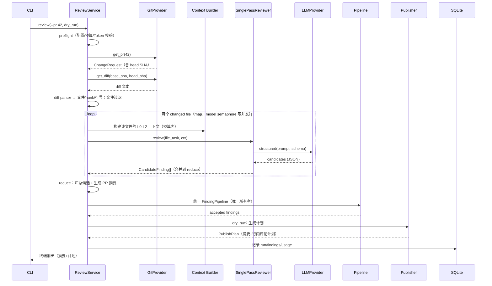
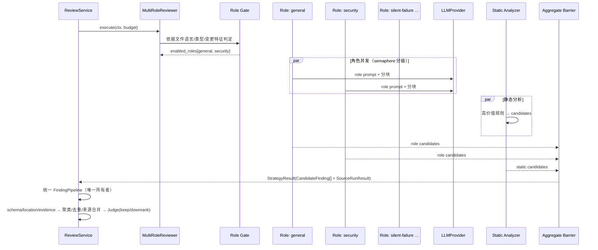
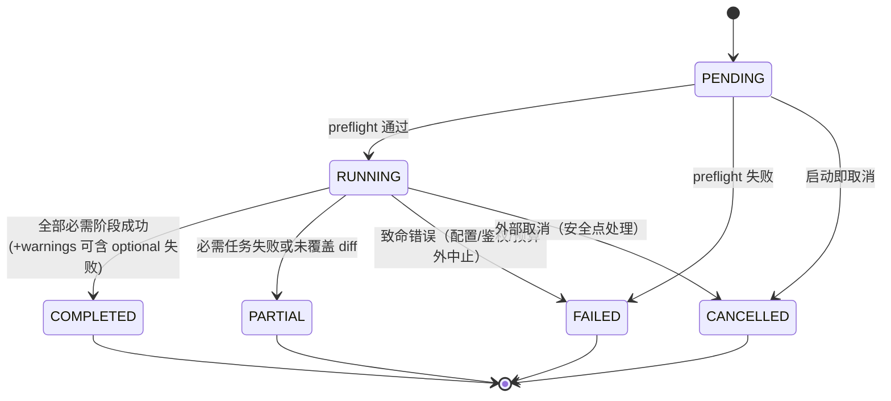
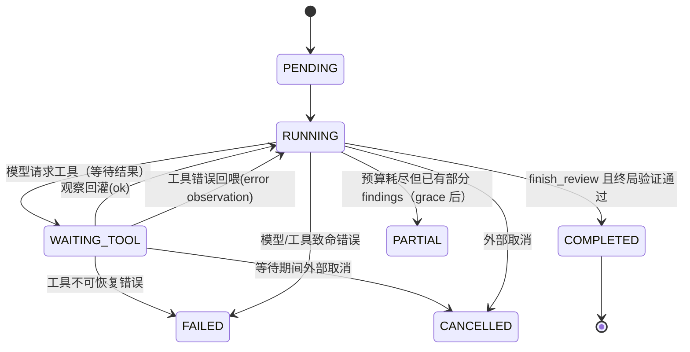

# 04 — 运行时流程（Runtime Flows）

> V1/V2/V3 时序、异步与并发模型、事件循环、状态机、失败与降级流程。
> 标注：`V1 now` / `V2 later` / `V3 later` / `optional`。

---

## 1. 总流程（三版共用骨架）

```text
preflight → fetch(锁定 SHA) → diff 解析与过滤 → 上下文构建
→ ReviewStrategy.execute（版本差异点）→ Finding 流水线 → 发布 → 落库/可观测
```

任何版本的差异只发生在 **ReviewStrategy.execute** 内部；骨架由 `ReviewService` 编排，保持不变。

## 2. V1：SinglePass 时序（V1 now）

### V1 审查粒度契约（P0-5）：per-file map-reduce

```text
按 changed file 建 ReviewTask（map）
→ 文件内按 hunk/符号构造一个或多个 chunk（token-aware）
→ 每文件通常一次模型审查；超预算文件才分块多次
→ 文件任务之间由 model semaphore 限并发
→ 文件结果汇总（reduce）后生成 PR 摘要
```

这一契约固定了 V1 的 Token、并发、任务模型、部分成功与摘要聚合语义：`file_tasks=3/model_requests=3` 对应真实的文件级并发；"单文件失败 → PARTIAL"才有实际含义。



### 并发模型（V1）
- 全程 `asyncio`；GitHub 请求、模型请求为等待型 IO。
- `semaphore(github=5, model=3, file=3)`：**文件任务是真并发**（map 阶段），每文件一次模型审查；超预算文件内部分块时，块仍串行执行以控制成本。
- CLI 同步等待最终结果，内部仍异步。

### 错误与降级
| 场景 | 行为 |
|------|------|
| GitHub 限流/超时 | 指数退避重试（max 2 次）后 FAILED，明确失败原因 |
| 模型超时/网络错 | 重试；重试后失败 → 该文件任务 fail-soft，CoverageManifest 标记未覆盖 |
| JSON 解析失败 | 单次修复重试（把错误回喂模型）→ 仍失败则丢弃该文件块并记录 |
| 单文件失败 | PARTIAL 状态，其他文件结果保留（map 阶段已隔离） |
| 预算超限 | 停止新的模型调用，已产出结果照常走流水线 |

## 3. V2：MultiRoleReviewer 时序（V2 later）



### 门控规则（确定性，非模型决定）
- 语言门：`review.languages` 内才启用对应角色。
- 特征门：security 需要新增行涉及 IO/鉴权/反序列化等；silent-failure 需要异常/回调/异步相关改动（规则见 `07` §3）。
- 角色注册表：`RoleSpec{id, gate, model_requirement, concurrency}`。

### 聚合 barrier
- 所有启用角色 + 静态分析完成后聚合；任一角色失败 → fail-soft：记录角色失败，其余角色结果继续。
- **所有权**：barrier 只做聚合与来源标记，产出 `CandidateFinding` 交给外层统一 `FindingPipeline`；正式生命周期（校验/去重/Judge/accepted）不在 Strategy 内执行（见 `03` §5）。

### V2 增量审查（watermark）
- 只审查 `last_reviewed_sha → head_sha` 之间的新增提交；`ReviewRun` 记录 watermark。
- 发布采用 Saga/Outbox 状态机（prepared → published → supersede → watermark），不宣称跨系统原子事务（详见 `07` §7）。

## 4. V3：AgenticReviewer（V3 later）

### 总体模型
- **任务级有限并发**：不同文件/任务可以并行各自跑一个 Agent 会话；**单 Agent 轨迹内严格顺序**事件循环。
- 安全点：模型调用完成或工具调用完成之后才处理新事件/取消。

```mermaid
sequenceDiagram
    participant AG as AgenticReviewer (per task)
    participant LOOP as Event Loop
    participant LLM as LLMProvider
    participant TOOLS as Tools Registry
    participant MEM as Agent Session Memory
    participant BUD as Budget

    AG->>LOOP: 初始化 session（任务上下文 + 工具清单）
    loop 直到 finish_review / 预算耗尽 / 取消
        LOOP->>LLM: 组装 messages（含工具 schema）
        LLM-->>LOOP: 1) finish_review 2) submit_finding 3) tool_call
        alt tool_call
            LOOP->>TOOLS: 参数校验 → 沙箱 → 执行
            TOOLS-->>LOOP: ToolResult（截断+来源+错误协议）
            LOOP->>MEM: 记录观察
            LOOP->>BUD: 扣除工具预算
        else submit_finding
            LOOP->>PIP: candidate（标记 evidence=tool/diff）
        else finish_review
            LOOP->>LOOP: 进入终局：统一验证（见 08 §7）
        end
        LOOP->>BUD: 检查轮数/Token/费用/墙钟/重复调用
    end
```

### 事件循环伪代码（详见 `08` §6 的完整版）

```text
while not terminal:
    budget.check()                        # 安全点 1：预算/墙钟/取消
    resp = llm.tool_loop(session.messages, tools)   # 等待型 IO（安全点 2 之后）
    match resp.action:
        tool_call:  validate → sandbox → execute → truncate → append_observation
        submit_finding: validate → pipeline(candidate)
        finish_review: break
        none:  # 模型既没调用工具也没完成
            if resp.text 无新信息: 视为空转, 计数+1; 超过阈值 → 强制终止(标记非正常完成)
            else: 记录结构化决策摘要（不保存隐含思维链）
    if resp.action == tool_call:
        detect_repeat(tool,args)          # 重复调用检测
        session.maybe_compact()           # 上下文超限时压缩（见 08 §8）
```

## 5. 状态机

### ReviewRun 状态机（三版共用，P1-R2-4：部分成功归并）

**归并规则**：
- **必需任务**（required file/role/agent 任务）失败或**未覆盖 diff** → `PARTIAL`。
- **optional 任务**（optional role、supersede 清理、telemetry 附件）失败 → `COMPLETED` + `warnings`（不放大为 PARTIAL）。
- **分析状态与发布状态分开记录**：`ReviewRun.status`（分析）与 `publish_status`（prepared/published/partial/cleanup_pending/…，见 `07` §7）独立；"审查完成但评论清理失败"不描述为审查质量不完整。
- `StageResult` 增加 `required` 标记，供归并与覆盖披露使用。



合法转换表（非法转换在代码中断言）：

| 从 \ 到 | PENDING | RUNNING | COMPLETED | PARTIAL | FAILED | CANCELLED |
|---------|:--:|:--:|:--:|:--:|:--:|:--:|
| PENDING | – | ✅ | ❌ | ❌ | ✅ | ✅ |
| RUNNING | ❌ | – | ✅ | ✅ | ✅ | ✅ |
| COMPLETED/PARTIAL/FAILED/CANCELLED | ❌ | ❌ | – | ❌ | ❌ | ❌ |

> FAILED 与 CANCELLED 允许从 PENDING 直接进入（preflight 失败、启动即取消）。

### AgentTask 状态机（V3）



非法转换示例：`WAITING_TOOL → COMPLETED`（工具结果未回灌不允许终局）；`PENDING → WAITING_TOOL`（未初始化不允许）。合法转换以转换表为准（P1-4）。

## 6. 异步、并发与限流汇总

| 机制 | V1 | V2 | V3 |
|------|----|----|----|
| I/O async（GitHub/LLM/存储） | ✅ | ✅ | ✅ |
| 文件级并发 | ✅（分块装配并行） | ✅ | 任务级并行（task semaphore） |
| 角色并发 | – | ✅（role semaphore） | –（Agent 内顺序） |
| 模型请求并发 | semaphore 3 | 分级限流（角色级+全局） | 每 Agent 顺序，任务间并发受控 |
| 聚合 barrier | – | ✅ | – |
| 事件/取消安全点 | 阶段间 | 阶段间 | 模型/工具调用后 |

## 7. 失败、重试、取消与幂等策略

- **重试**：网络/限流类可重试（指数退避）；模型输出校验类单次修复重试；业务逻辑错误不重试直接失败。
- **取消**：外部取消在安全点检查；取消后已落库的部分结果保留并标记 CANCELLED。
- **部分成功（P1-R2-4 归并）**：必需任务失败或未覆盖 diff → PARTIAL；optional 任务（optional role/清理/telemetry）失败 → COMPLETED + warnings。分析状态（ReviewRun.status）与发布状态（publish_status）分开记录，写 CoverageManifest（覆盖哪些文件/角色、哪些缺失）。
- **幂等**：fingerprint（稳定问题指纹）→ DB 去重（`UNIQUE(run_id, fingerprint)`）；发布用 Saga + marker/remote_comment_id 恢复；watermark 防止重复审查区间（详见 `07` §7 / `10` §7）。
- **背压**：semaphore 排队，不无限堆积；预算检查在排队前执行。

## 7b. 边界流程（本轮补充）

| 场景 | 行为 |
|------|------|
| PR 为 draft | 提示用户（可配置跳过或照常审查） |
| PR 无变更（empty diff） | 直接 COMPLETED：只产摘要，零评论，CoverageManifest 全空 |
| 全部文件被过滤（生成/lock/二进制/不支持语言） | COMPLETED + 摘要说明过滤原因；不进模型调用（零成本） |
| 纯删除/重命名 PR | diff parser 正常解析；删除文件无新增行 → 无行内评论锚点，问题走 body_only/摘要 |
| fork PR 权限不足 | 只读拉取通常可行；发布评论时 403 → plan=partial + 明确错误，watermark 不推进 |
| head SHA 漂移 | 拒绝并提示重跑（默认，见 `14` OQ-6） |
| 审查中断（kill/断电） | 已落库结果保留；重跑按 run 状态恢复（PENDING/RUNNING 重新开始，PARTIAL/COMPLETED 幂等继续） |

## 8. 降级路径总表

| 触发 | 降级动作 | 对用户可见影响 |
|------|----------|----------------|
| 模型 JSON 不稳定 | 修复重试 → 丢弃块 → 记录 | 覆盖下降，CoverageManifest 披露 |
| 超大 PR（文件/Token 超预算） | 文件优先级排序、截断披露、跳过超限文件 | 摘要注明"覆盖不足"（见 `07` §8） |
| 角色失败 | fail-soft，其余角色继续 | PARTIAL + 角色覆盖标记 |
| 工具调用失败（V3） | 错误协议回喂模型；重试受限；证据缺失则降置信度 | Finding 标记 evidence_gap |
| 发布失败 | Saga 状态机：plan=partial，重跑经 DB 映射恢复（watermark 未推进可重跑） | 发布失败记录，重跑恢复 |
| DP-V4-PRO 不支持 tool calling | 方案 A 换模型 / 方案 B 受限协议，以同一评测集对比（见 `08` §9） | V3 适配方案切换或暂缓 |
