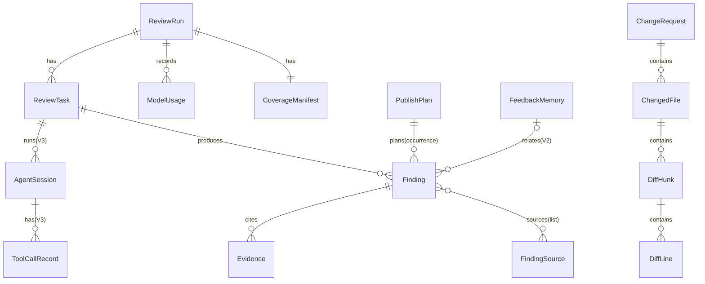
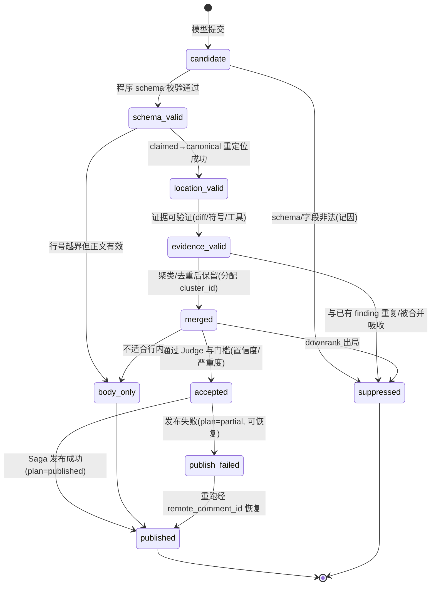

# 05 — 领域数据设计

> 完整领域模型、Finding 生命周期、SQLite 概念数据模型。
> 标注：`V1 now` / `V2 later` / `V3 later` / `optional`。
> 本章所有"模型"均为领域对象（Pydantic），不是数据库表；数据库见 §6。

---

## 1. 领域模型总览（ER 关系）



## 2. 核心模型字段定义

### RepositoryRef
| 字段 | 类型 | 约束 |
|------|------|------|
| `provider` | enum(github, local) | 必填 |
| `owner` / `name` | str | GitHub 时必填 |
| `local_path` | Path | local 时必填，绝对路径 |
| `default_branch` | str | 默认 main/master |

### CommitRef
| 字段 | 类型 | 约束 |
|------|------|------|
| `sha` | str | 40 位（或 git 缩写已展开） |
| `branch` | str \| None | 分支名（head 时） |
| `label` | enum(base, head) | 区分基准/目标 |
| `locked` | bool | head 必须 locked=true 才能审查 |

### ChangeRequest（P1-R2-3：统一本地/远程输入来源）
本地离线审查（`--base/--head`）没有 GitHub PR number，也不一定有 title/description；远程 GitHub PR 才有。抽象 `ChangeRequest` 兼容两种来源：

| 字段 | 类型 | 约束 |
|------|------|------|
| `source` | enum(local_range, github_pr) | 输入来源 |
| `external_id` | str \| None | GitHub PR number（github_pr 时；local_range 为 None） |
| `base` / `head` | CommitRef | head SHA 全程锁定 |
| `title` / `description` | str \| None | 可选；视为不可信数据 |
| `author` | str \| None | 记录（可选） |
| `is_draft` | bool \| None | draft 可跳过或提示（仅 github_pr） |
| `labels` / `assignees` | list[str] \| None | 可选上下文 |

### ChangedFile
| 字段 | 类型 | 约束 |
|------|------|------|
| `path` | Path | 仓库相对路径，禁止 `..`/绝对 |
| `status` | enum(added, modified, deleted, renamed) | parser 产出 |
| `old_path` | Path \| None | renamed 时 |
| `language` | str \| None | 语言识别 |
| `is_binary` / `is_generated` / `is_locked` | bool | 过滤用 |
| `additions` / `deletions` | int | 统计 |
| `size_bytes` | int | 超限过滤 |

### DiffHunk / DiffLine
| 字段 | 类型 | 约束 |
|------|------|------|
| `hunk_id` | str | 文件内唯一 |
| `header` | str | `@@ -a,b +c,d @@` |
| `new_start` / `new_count` | int | 新文件行号区间 |
| `old_start` / `old_count` | int | 旧文件行号区间 |
| `lines` | list[DiffLine] | 有序 |

| `DiffLine` 字段 | 类型 | 约束 |
|------|------|------|
| `type` | enum(context, added, removed) | 只 added 是评论候选锚点 |
| `old_ln` / `new_ln` | int \| None | 新旧行号（context 两有） |
| `content` | str | 原文（去尾换行） |
| `is_blank` | bool | 过滤 |

### ReviewContext / ContextChunk / ContextSource
| 字段 | 类型 | 约束 |
|------|------|------|
| `run_id` | str | 关联 |
| `chunks` | list[ContextChunk] | 按 L0–L4 分层 |
| `total_tokens` / `budget_tokens` | int | 预算内 |
| `truncated` | bool | 截断标记 |

| `ContextChunk` 字段 | 类型 | 约束 |
|------|------|------|
| `layer` | enum(L0,L1,L2,L3,L4) | 见 `06` §1 |
| `source` | ContextSource | 引用出处 |
| `content` | str | 文本 |
| `tokens` | int | 统计 |
| `cache_key` | str | 缓存失效键（见 `06` §7） |

| `ContextSource` 字段 | 类型 | 约束 |
|------|------|------|
| `kind` | enum(diff, file, symbol, rules, feedback, issue, system) | 来源类别 |
| `ref` | str | 如 `file:src/a.py` / `symbol:foo` / `rule:python.01` |
| `sha` | str \| None | 内容版本（blob sha / rules hash） |

### Finding / Evidence / FindingSource
Finding 是核心对象，字段见 §3 单独展开。

| `Evidence` 字段 | 类型 | 约束 |
|------|------|------|
| `kind` | enum(diff_line, file_region, symbol_def, symbol_ref, tool_result, static_result) | 证据类别 |
| `location` | str | 文件+行 或 符号 |
| `content` | str | 截断后的证据文本 |
| `tool_call_id` | str \| None | V3 追溯工具调用 |
| `verified` | bool | 程序验证通过标记 |

| `FindingSource` 字段 | 类型 | 约束 |
|------|------|------|
| `kind` | enum(llm_role, llm_general, static_analyzer, tool_agent, judge) | 来源 |
| `role_id` / `analyzer_id` | str \| None | 具体角色/分析器 |
| `confidence` | float | 该来源自身置信度 |
| `verified_by` | enum(program, model) | 事实字段只能 program |

### ReviewTask / RoleSpec
| 字段 | 类型 | 约束 |
|------|------|------|
| `task_id` | str | run 内唯一 |
| `kind` | enum(file_review, role_review, agent_task) | V1/V2/V3 分别使用 |
| `target` | str | 文件路径或角色 id |
| `status` | ReviewTaskStatus | 见 `04` §5 |
| `input_tokens` / `output_tokens` / `cost_usd` | float | 累计 |
| `error` | str \| None | fail-soft 记录 |

| `RoleSpec` 字段 | 类型 | 约束 |
|------|------|------|
| `id` | str | 如 `security` |
| `gate` | Callable/规则 | 确定性门控（见 `07` §3） |
| `model_requirement` | str | 路由到合适模型能力档 |
| `enabled` | bool | 配置覆盖 |

### ToolDefinition / ToolCall / ToolResult（V3）
| 字段 | 类型 | 约束 |
|------|------|------|
| `name` / `description` | str | registry 唯一 |
| `parameters` | JSON Schema | 程序校验 |
| `permissions` | enum(read_only) | 全只读 |
| `result_limit` | int | 截断上限 |
| `timeout_s` | int | 单次工具超时 |

| `ToolCall` 字段 | 类型 | 约束 |
|------|------|------|
| `tool_call_id` | str | 全局唯一 |
| `name` / `arguments` | str/dict | 记录 |
| `status` | enum(ok, error, invalid_args, timeout, cancelled) | 调用状态 |
| `repeat_of` | str \| None | 重复检测标记 |
| `tokens_used` | int | 计入预算 |
| `attempt_count` | int | 含无效调用的累计尝试（P1-5） |

| `ToolResult` 字段 | 类型 | 约束 |
|------|------|------|
| `tool_call_id` | str | 关联 ToolCall |
| `data` | str \| None | 成功返回（截断） |
| `error` | str \| None | 错误信息（错误协议） |
| `truncated` | bool | 结果是否截断 |
| `source` | ContextSource \| None | 来源标记 |
| `tokens` | int | 计入上下文预算 |

> 调用状态（ToolCall）与返回数据/错误（ToolResult）分离建模（P1-9）。

### AgentMessage / AgentSession / AgentBudget（V3）
| `AgentMessage` 字段 | 类型 | 约束 |
|------|------|------|
| `role` | enum(system, user, assistant, tool) | 消息角色 |
| `content` | str | 观察/工具结果（截断+来源） |
| `is_compressed` | bool | 压缩标记 |
| `summary_ref` | str \| None | 压缩摘要索引 |

| `AgentSession` 字段 | 类型 | 约束 |
|------|------|------|
| `session_id` | str | 关联 task_id |
| `messages` | list[AgentMessage] | 内存态 |
| `evidence_index` | dict[str, Evidence] | 已确认证据 |
| `checked` / `excluded` / `pending` | sets | 会话记忆（见 `06` §4） |
| `status` | AgentTaskStatus | 见 `04` §5 |

| `AgentBudget` 字段 | 类型 | 约束 |
|------|------|------|
| `max_rounds` / `max_tool_calls` / `max_tokens` / `max_cost_usd` / `max_wallclock_s` | int/float | 硬预算 |
| `grace_rounds` | int | 预算耗尽后的受限轮（只准提交证据或 finish） |
| `repeat_threshold` | int | 重复调用终止阈值 |

### ReviewRun / StageResult / CoverageManifest（P1-R2-4：分析/发布状态分离）
| 字段 | 类型 | 约束 |
|------|------|------|
| `run_id` | str | UUID |
| `external_ref` / `base_sha` / `head_sha` | str \| None | external_ref 仅 github_pr 来源；本地模式为 None |
| `strategy` | enum(single_pass, multi_role, agentic) | 本次实际 |
| `status` | ReviewRunStatus | 分析状态，见 `04` §5（P1-R2-4 归并规则） |
| `publish_status` | enum(dry_run, prepared, publishing, published, partial, failed, cleanup_pending, completed) | 发布状态，与分析状态独立 |
| `warnings` | list[str] | optional 任务失败等警告（不放大为 PARTIAL） |
| `started_at` / `finished_at` | datetime | 耗时 |
| `stages` | list[StageResult] | 阶段 trace |
| `coverage` | CoverageManifest | 覆盖清单 |
| `config_snapshot_hash` | str | 可复现 |

| `StageResult` 字段 | 类型 | 约束 |
|------|------|------|
| `stage` | enum(preflight, fetch, context, review, pipeline, publish) | 阶段 |
| `status` | enum(ok, partial, failed) | |
| `required` | bool | 是否必需任务（P1-R2-4 归并使用） |
| `duration_ms` / `tokens` / `cost_usd` | int/float | |
| `error` / `detail` | str \| None | 失败原因 |

| `CoverageManifest` 字段 | 类型 | 约束 |
|------|------|------|
| `items` | list[CoverageItem] | 统一条目结构（P1-9） |
| `truncated` | bool | 披露覆盖不足 |

| `CoverageItem` 字段 | 类型 | 约束 |
|------|------|------|
| `target` | str | 文件路径 / 角色 id / agent task id |
| `reason` | enum(covered, skipped_size, skipped_lang, skipped_generated, role_failed, task_failed, truncated) | 覆盖或跳过原因 |
| `stage` | enum(fetch, context, review, pipeline, publish) | 在哪个阶段决定 |
| `detail` | str \| None | 补充说明 |

### PublishPlan / PublishOperation / CommentPlan（P0-2 Saga 状态机）
| 字段 | 类型 | 约束 |
|------|------|------|
| `plan_id` | str | 主键 |
| `run_id` | str | 关联运行 |
| `mode` | enum(dry_run, publish) | |
| `status` | enum(prepared, publishing, published, partial, failed, cleanup_pending, completed) | 见 `07` §7（P0-R2-2） |
| `summary_comment` | str \| None | PR 摘要 |
| `comments` | list[CommentPlan] | 行内+正文评论计划 |
| `operations` | list[PublishOperation] | supersede 清理等独立任务 |
| `watermark` | str \| None | published 后推进的 last_reviewed_sha |

| `CommentPlan` 字段 | 类型 | 约束 |
|------|------|------|
| `comment_id` | str | 本地计划主键 |
| `required` | bool | 必须项（summary + V1 全部 accepted；见 `07` §7） |
| `finding_occurrence_id` / `fingerprint` | str | 关联 Finding |
| `kind` | enum(inline, body, summary) | 评论类型 |
| `path` / `line` | str/int | canonical 位置，必须落在 diff 新增行 |
| `body` | str | 触发/影响/证据/建议 |
| `marker` | str | 机器人隐藏 marker（幂等识别） |
| `remote_comment_id` | int \| None | 发布成功后 GitHub 评论 ID |
| `status` | enum(prepared, published, failed, superseded) | 逐条状态 |

| `PublishOperation` 字段 | 类型 | 约束 |
|------|------|------|
| `op_id` | str | 主键 |
| `kind` | enum(supersede_cleanup) | 操作类型 |
| `status` | enum(pending, running, done, failed) | 独立可重试任务 |
| `detail` | str \| None | 清理对象（旧评论 IDs） |

### FeedbackMemory（V2，P0-R2-1：条件化匹配）
| 字段 | 类型 | 约束 |
|------|------|------|
| `repo` | str | 仓库作用域 |
| `kind` | enum(false_positive, wont_fix, rule) | 反馈类型 |
| `scope` | str \| None | 匹配范围（如文件 glob） |
| `path` | str \| None | 文件路径条件 |
| `symbol` | str \| None | 符号条件 |
| `category` | str \| None | 类别条件 |
| `rule_key` | str \| None | 规则键条件（如 `rule:python.sec-01`） |
| `pattern` | str \| None | 文本/正则模式 |
| `cross_run_match_key` | str \| None | 精确指纹（可选；代码移动后可用条件匹配兜底） |
| `rationale` | str | 理由（用户提供） |
| `active` | bool | 可撤销（软删除） |
| `created_at` / `revoked_at` | datetime | 审计 |

### ModelUsage（P0-R2-3 补充：迟到响应记账）
| 字段 | 类型 | 约束 |
|------|------|------|
| `model` | str | 实际模型名 |
| `role` | str | 用途（general/security/judge/agent…） |
| `input_tokens` / `output_tokens` | int | Token 计数字段为 int（P1-9） |
| `cost_usd` | float | 费用（美元） |
| `outcome` | enum(completed, late_cancelled, failed) | 墙钟超时/取消后的迟到响应记 late_cancelled：usage/cost 仍入账，结果不入审查 | 
| `latency_ms` | int | |
| `retries` / `schema_repairs` | int | 可靠性指标 |
| `prompt_hash` / `schema_hash` | str | 缓存与复现 |

## 3. Finding 完整定义

### 三重身份（P0-3 / P0-R2-1）

```text
finding_occurrence_id：UUID，本次 run 的记录主键（每 run 唯一）
fingerprint：单次运行内去重指纹（聚类结果计算）
cross_run_match_key：跨运行匹配键（容忍代码移动），反馈与幂等关联
cluster_id：本次聚类后的逻辑问题（先聚类，后为聚类结果计算 fingerprint）
```

**最终 DB 字段命名（用户裁定）**：`candidate_fingerprint` 不保留为字段名——run 内去重统一用 `fingerprint`，跨 run 匹配统一用 `cross_run_match_key`。

**指纹两层键（P0-R2-1）**——不能只对自然语言内容做哈希：

```text
fingerprint = hash(repo, head_sha, canonical_path, line_anchor,
                   normalized_category, normalized_rule_or_issue_key)
cross_run_match_key = hash(repo, canonical_path, symbol_or_anchor,
                   normalized_category, normalized_rule_or_issue_key)
```

- `fingerprint` 用于同 run 内去重；`cross_run_match_key` 用于跨 run 匹配反馈/幂等（不含 head_sha 与行号，容忍代码移动）。
- **聚类先于 fingerprint**：聚类依据同文件、重叠/邻近行、兼容类别与语义相似规则（规则键归一）合并候选，再为聚类结果计算 fingerprint；不能先依赖 fingerprint 完成语义去重。
- 自然语言字段（title/explanation）不进入指纹；规则键（如 `rule:python.sec-01`）与类别归一化后参与。

| 字段 | 类型 | 约束 | 谁写入 |
|------|------|------|--------|
| `finding_occurrence_id` | UUID | 本次 run 记录主键 | 程序 |
| `fingerprint` | str | run 内去重指纹（sha256，聚类结果计算） | 程序 |
| `cross_run_match_key` | str | 跨 run 匹配键（容忍代码移动） | 程序 |
| `cluster_id` | str | 本次聚类后逻辑问题 | 程序 |
| `title` | str | 一句话问题 | 模型候选 |
| `severity` | enum(critical, high, medium, low, info) | 程序+模型交叉 | 模型候选/程序修正范围 |
| `confidence` | float 0–1 | 程序验证后重估 | 程序可下调不可上调 |
| `category` | enum(correctness, security, silent_failure, concurrency, edge_case, test_gap, performance, maintainability) | 枚举白名单 | 模型候选 |
| `claimed_path` | str \| None | 模型声明位置（线索） | 模型候选 |
| `claimed_start_line` / `claimed_end_line` | int \| None | 模型声明行号（线索） | 模型候选 |
| `chunk_id` / `evidence_ref` | str \| None | 模型引用上下文块/证据来源 | 模型候选 |
| `canonical_path` | str \| None | 程序确认的仓库相对路径（沙箱校验） | 仅程序 |
| `canonical_start_line` / `canonical_end_line` | int \| None | 程序确认行号，必须落在 diff 新增行（否则 body_only） | 仅程序 |
| `trigger_condition` | str | 触发场景 | 模型候选 |
| `impact` | str | 影响 | 模型候选 |
| `explanation` | str | 为什么是问题 | 模型候选 |
| `evidence` | list[Evidence] | 至少 1 条；V3 须可追溯 | 模型候选 + 程序标记 verified |
| `suggestion` | str | 修复方向（不自动应用） | 模型候选 |
| `sources` | list[FindingSource] | 多来源（P1-9：角色/静态/Agent 可合并） | 程序 |
| `is_outside_diff` | bool | 是否引用 diff 外内容 | 程序 |
| `status` | FindingStatus | 生命周期状态 | 仅程序推进 |
| `versions` | list[FindingVersion] | 状态变化审计 | 程序 |

### Finding 生命周期与状态机

```text
candidate → schema_valid → location_valid → evidence_valid → merged
→ accepted / suppressed / body_only → published / publish_failed
```



**状态推动权**（铁律）：

| 状态变化 | 推动者 | 说明 |
|----------|--------|------|
| candidate → 后续任一 | **仅程序**（统一 FindingPipeline） | 模型永远只产出 candidate |
| schema 校验 | 程序（Pydantic + 枚举白名单） | 非法字段 → suppressed(记因) |
| location 校验 | 程序（claimed → canonical 重定位 + diff 行号表） | 越界 → body_only 或 suppressed |
| evidence 校验 | 程序（diff/符号/工具结果比对） | 无法验证 → 置信度下调或 suppressed |
| merged / accepted / suppressed | 程序 + Judge（V2 起） | Judge 只 keep/downrank |
| published / publish_failed | 程序（Saga 发布状态机） | 模型无权触达；plan 状态见 `07` §7 |

## 4. 模型不得写入的字段（幻觉防线）

**canonical 事实字段与验证状态只能由程序写入**：`canonical_path`、`canonical_start_line/end_line`、`evidence[].verified`、`finding_occurrence_id`、`fingerprint`、`cluster_id`、`status`、`sources`、成本与 token 统计。模型提交这些字段时，程序**忽略并用程序值覆盖**。

模型可以（且鼓励）提供**位置线索**：`claimed_path/claimed_start_line/claimed_end_line` 或引用 `chunk_id/evidence_ref`。程序根据当前任务范围、diff 映射与引用做确认/重定位（P0-4）；无法重定位时降级 body_only 或 suppressed，而不是丢弃线索。

## 5. 版本演进对模型的影响

| 模型 | V1 | V2 | V3 |
|------|----|----|----|
| ChangeRequest/CommitRef/ChangedFile/Diff | ✅ | ✅ | ✅ |
| ReviewContext/ContextChunk | L0–L2 | +L3 符号 | +工具检索来源 |
| Finding（candidate 状态） | ✅ | ✅ | ✅ |
| FindingSource | 仅 llm_general | +llm_role/static/judge | +tool_agent |
| Evidence.verified | diff 行 | +符号 | +工具结果 |
| ReviewTask | file_review | +role_review | +agent_task |
| Agent 系列模型 | – | – | ✅ |
| FeedbackMemory | – | ✅ | ✅ |
| CoverageManifest.roles/agent_tasks | – | ✅ | ✅ |

**兼容原则**：新增字段一律 optional 或带默认值；既有字段语义不变（如 `status` 枚举只增不删）。

## 6. SQLite 概念数据模型（非建表代码）

```mermaid
erDiagram
    runs ||--o{ tasks : ""
    runs ||--o{ usages : ""
    runs ||--o{ findings : ""
    runs ||--|| coverages : ""
    runs ||--o{ publish_plans : ""
    tasks ||--o{ tool_calls : ""
    tool_calls ||--o| tool_results : ""
    findings ||--o{ finding_versions : ""
    findings ||--o{ published_comments : ""
    publish_plans ||--o{ published_comments : ""
    feedback o|--o{ findings : "by fingerprint"
    PR_caches ||--o| diffs : ""

    runs { str run_id PK; str external_ref; str base_sha; str head_sha; str strategy; str status; str config_hash; datetime started_at; datetime finished_at }
    tasks { str task_id PK; str run_id FK; str kind; str target; str status; int in_tokens; int out_tokens; float cost_usd; str error }
    usages { int id PK; str run_id FK; str model; str purpose; int in_tokens; int out_tokens; float cost_usd; int latency_ms; int retries; str prompt_hash }
    findings { str finding_occurrence_id PK; str run_id FK; str fingerprint; str cross_run_match_key; str cluster_id; str title; str severity; float confidence; str category; str claimed_path; int claimed_start; int claimed_end; str canonical_path; int canonical_start; int canonical_end; str status; str evidence_json; str sources_json; bool is_outside_diff }
    finding_versions { int id PK; str finding_occurrence_id FK; str from_status; str to_status; str actor; datetime at; str reason }
    coverages { str run_id PK; str items_json; bool truncated }
    tool_calls { str tool_call_id PK; str task_id FK; str name; str args; str status; str repeat_of; int tokens_used; int attempt_count }
    tool_results { str tool_call_id PK, FK; str data; str error; bool truncated; int tokens }
    publish_plans { str plan_id PK; str run_id FK; str status; str mode; str watermark }
    published_comments { int id PK; str plan_id FK; str finding_occurrence_id FK; str fingerprint; str kind; str path; int line; str body; str marker; int remote_comment_id; str status }
    feedback { int id PK; str repo; str kind; str scope; str path; str symbol; str category; str rule_key; str pattern; str rationale; bool active; datetime created_at; datetime revoked_at }
    PR_caches { str pr_key PK; str base_sha; str head_sha; str diff_hash; datetime fetched_at }
```

设计要点：
- **身份拆分（P0-3）**：findings 表以 `finding_occurrence_id`（UUID）为主键，`UNIQUE(run_id, fingerprint)` 保证同 run 内去重；feedback 与 published_comments 通过 `cross_run_match_key` 跨 run 关联（P0-R2-1）。
- **指纹语义（P0-R2-1，最终命名）**：聚类先于指纹；`fingerprint` 用于 run 内去重，`cross_run_match_key` 用于跨 run 匹配；自然语言不进指纹；不保留 `candidate_fingerprint` 字段名。
- **运行记忆**（runs/tasks/usages/findings/finding_versions/coverages/tool_calls/tool_results）从 V1 起落地，支撑成本/覆盖/评测。
- **发布状态**（publish_plans/published_comments）从 V1 建好：`status` 走 Saga（prepared→publishing→published/partial/failed→cleanup_pending→completed，见 `07` §7）。
- **反馈记忆**（feedback）V2 启用，`active` 软删除实现可撤销；匹配条件为 scope/path/symbol/category/rule/pattern（不只 fingerprint 精确匹配，见 `06` §4）。
- **缓存表**（PR_caches）仅存可复现元数据，不存模型推理原文，避免隐私扩散（见 `06` §7）。
- 不默认向量检索：feedback 用条件化结构化匹配；评测信号达标后再评估 embedding（见 `06` §6）。
