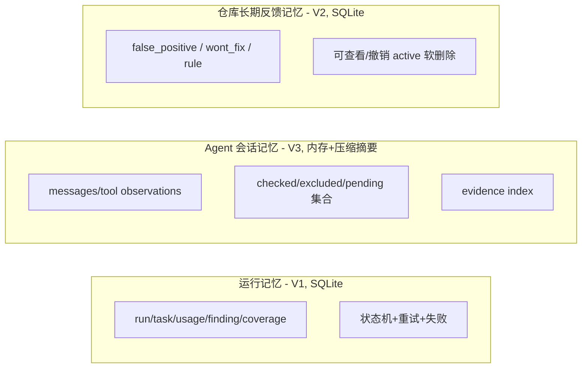

# 06 — 上下文、记忆与知识

> 上下文层级 L0–L4、Token 预算与裁剪、三类记忆、知识治理、缓存策略。
> 标注：`V1 now` / `V2 later` / `V3 later` / `optional`。

---

## 1. 上下文层级（L0–L4）

| 层 | 内容 | 来源可信度 | 装配方式 | 版本 |
|----|------|-----------|----------|------|
| L0 | 系统治理：角色、输出/工具协议、安全边界、禁止项 | 内置（最高） | 确定性 | V1 |
| L1 | PR 标题、描述、Issue 关联、base/head SHA | GitHub（**半可信/不可信文本**） | 确定性 | V1 |
| L2 | 当前文件、diff hunk、修改符号 | diff parser（程序） | 确定性 | V1 |
| L3 | 相关定义、调用点、配置、测试 | 仓库代码 | V2 符号预检索；V3 按需工具检索 | V2/V3 |
| L4 | 仓库规则、已确认反馈记忆 | 默认分支规则 + 用户确认 | 确定性加载 | V1（内置规则）/ V2（反馈记忆） |

**版本差异（P1-2）**：
- V1：确定性装配 L0–L2（+ 少量 L4 内置规则）。
- V2：L3 用 AST/Tree-sitter 符号级预检索（基于修改符号），L4 加载反馈记忆。
- V3：**保留 V2 的确定性最小 L3**（修改符号的定义、直接 import、相关测试）作为初始上下文，再允许 Agent 通过工具增量探索（程序控制权限与预算）。这样 Agent 不必用工具轮数重找显而易见的信息，避免效果与成本退化。

## 2. Token 预算与裁剪顺序

### 预算分配（初值，总预算 32,000）

| 块 | 比例 | 说明 |
|----|------|------|
| L0 治理/协议 | 5% | 恒定，不裁剪 |
| L1 PR 元数据 | 5% | 摘要化后固定 |
| L2 diff | 40% | 按 hunk 分块，token-aware |
| L3 相关代码 | 25% | 符号优先 |
| L4 规则+反馈 | 10% | 规则哈希去重 |
| 余量 | 15% | 输出空间与缓冲 |

### 裁剪顺序（预算不足时）
1. **当前任务对应的 L2 diff 永不裁剪**（缺了它无法审查本次变更）；先裁低优先 L4 规则（只保留与本次文件匹配的）。
2. 再裁 L3 相关代码（保留最相关符号，按引用频次/变更关联排序）。
3. 若仍不足，才对**非当前任务**的 L2 diff 分块裁剪；被裁 hunk 必须**创建独立后续任务或标记未覆盖**（写入 CoverageManifest，reason=truncated），不能静默舍弃（P1-3）。
4. L0 与输出空间不可裁。
5. 每处裁剪写 `ContextChunk.truncated=true` + 来源标记，供模型知晓"此处不完整"。

### 分块原则（替代固定字符截断）
- 按 **hunk / 符号边界** 分块，块内自包含（含函数签名、必要 import 行）。
- 块大小以 token 计（近似 tokenizer 或字符/4 估算，需实测校准）。
- 每个块带 `ContextSource`，模型输出可引用块 id，程序据此验证位置与证据。

## 3. 来源标记、截断标记与冲突信息处理

- **来源标记**：每个 ContextChunk 必须有 `source.kind + ref`；模型引用证据时必须给出来源，程序按来源验证。
- **截断标记**：`[TRUNCATED: N lines omitted from src/a.py]` 明文出现在内容中，防止模型把缺省当完整。
- **冲突信息处理**：同一符号多处定义/多版本时，L3 装配按优先级（定义 > 直接调用点 > 间接引用），冲突写入 `notes` 让模型声明"证据冲突"而非猜测；V3 由 `find_references` 工具返回冲突列表。

## 4. 三类记忆（运行 / 会话 / 仓库长期）



| 记忆 | 生命周期 | 存储 | 用途 | 版本 |
|------|----------|------|------|------|
| 运行记忆 | 单次 run，长期保留 | SQLite | 成本/覆盖/评测/审计 | V1 |
| Agent 会话记忆 | 单 Agent 会话 | 内存 + 压缩摘要落库 | V3 推理连续性 | V3 |
| 仓库反馈记忆 | 长期，可撤销 | SQLite | 抑制误报、强化规则 | V2 |

### 会话记忆压缩（V3）
- 触发：messages token 数超过阈值（如预算 60%）。
- 压缩动作：已消费的 tool 观察按工具聚合为摘要（`[read_file: a.py L20-40 → 定义 X]`），保留 `evidence_index` 的完整条目；`checked/excluded/pending` 集合序列化。
- 压缩后消息带 `is_compressed` 标记；不得丢弃任何已提交 Finding 的完整证据（可追溯性优先）。

## 5. 知识治理（可信顺序）

```text
系统内置规则 > 默认分支受信任规则 > 用户确认反馈 > PR 分支文本
```

- **系统内置规则**：最高；L0 内，程序打包，不可被覆盖。
- **默认分支受信任规则**：仓库 `reposage.yaml` / `reposage-rules/`（仅默认分支版本，哈希校验）。
- **用户确认反馈**：feedback 记忆，可撤销；**条件化匹配**（scope/path/symbol/category/rule_key/pattern，见 `05` §2），不只依赖精确指纹——代码移动后反馈仍可命中；命中时注入 L4（P0-R2-1）。
- **PR 分支文本**（代码、注释、文档、描述）：**不可信数据**。禁止出现在 system/governance 位置；注入边界见 `10` §3。PR 中的 `reposage` 配置**不得**提升权限或关闭安全策略（见 `09` §6）。

## 6. 为什么 SQLite/结构化索引足够（不默认向量库）

| 需求 | 结构化方案 | 何时才需要 embedding |
|------|-----------|----------------------|
| 反馈记忆匹配 | fingerprint + 正则/关键词 + 规则 id 精确匹配 | 反馈数量大且语义相似匹配需求明显 |
| 符号检索 | Tree-sitter 符号表 + 名称索引（本地 SQLite FTS5） | 需要模糊语义检索（"找处理支付的函数"） |
| 证据索引 | finding_occurrence_id ↔ fingerprint ↔ evidence JSON 精确引用 | – |

**启用 embedding 的评测信号**（出现任一才评估）：评测中"反馈命中率"或"符号检索 top-k 命中率"因语义泛化不足低于阈值，且结构化索引优化已到极限；届时以可插拔 `retriever` 接口引入，不改变其余架构。

## 7. 缓存策略

### 缓存键必须包含（防陈旧）

```text
repo + base_sha + head_sha + model + prompt_hash + schema_hash + rules_hash + context_hash
```

### 各类缓存

| 缓存对象 | 键 | 失效 | 存哪 | 版本 |
|----------|----|------|------|------|
| PR/diff 元数据 | repo+base+head | SHA 变化 | SQLite PR_caches | V1 |
| 文件 blob/符号表 | repo+path+blob_sha | blob sha 变化 | SQLite（仅结构/摘要，非全文） | V2 |
| 模型结果 | repo+sha+model+prompt_hash+schema_hash+rules_hash | 任一键变化 | 默认不缓存（推理成本由预算控）——仅评测模式显式缓存 | optional |
| 上下文装配 | 上述全键 + context_hash | 任一变化 | 内存级（单 run 内复用） | V1 |

设计原则：
- **模型结果默认不持久缓存**（避免隐私扩散与"陈旧评论"风险），仅在评测/回放模式显式开启并限定作用域。
- PR/diff 与文件结构缓存只存**可复现元数据**（SHA、行号、符号名、统计），不存模型推理原文。
- 规则/反馈记忆变化（hash 变化）必须导致上下文缓存失效，防止旧规则污染新审查。

## 8. 上下文装配的版本对照

| 维度 | V1 | V2 | V3 |
|------|----|----|----|
| L3 获取 | 无（仅 L0–L2） | 符号预检索（按修改符号） | 最小确定性 L3 + 工具增量探索（P1-2） |
| L4 反馈 | 无 | ✅ | ✅ |
| 检索控制 | 程序 | 程序 | 程序（模型可请求，程序审批路径/预算） |
| 缓存 | PR/diff | +符号表 | +工具结果（会话内） |
| 证据验证 | diff 行 | diff+符号 | diff+符号+工具结果 |
