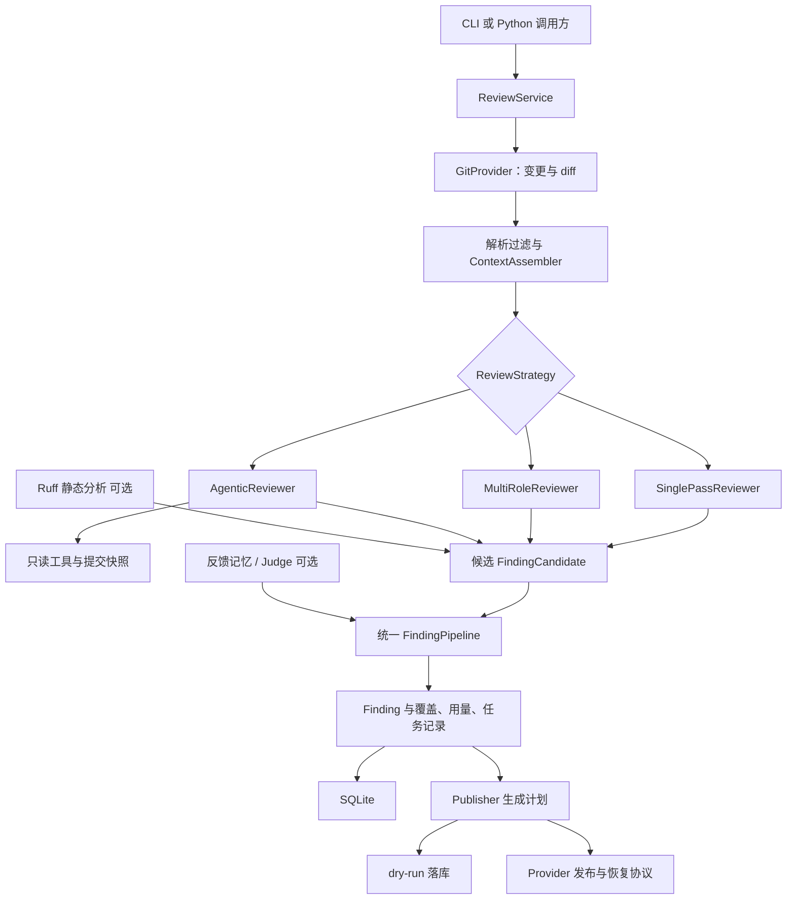
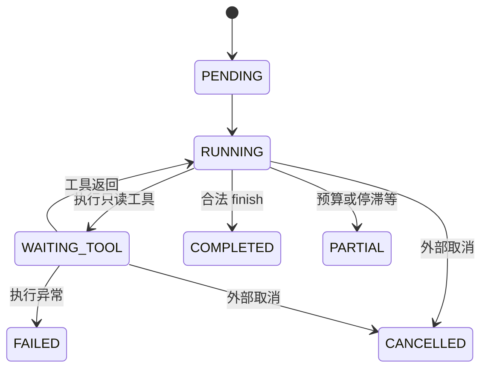

# RepoSage：完整项目剖析与面试学习手册

编写日期：2026-09-05。依据：当前工作区代码、架构对齐稿、历轮审查记录和评测产物。本文分析的是工作区现状，不能把尚未提交的代码等同于 Git HEAD 或正式发布标签。

本文的目标是让你能够从输入讲到输出、从实现讲到取舍、从故障讲到验证。建议第一次按顺序读，之后结合第 15 节做练习。文中的简化示例用于解释机制，不是新增的实验结果。

## 阅读地图

1. 项目定位与真实边界
2. 必须先懂的术语
3. 整体架构与数据模型
4. 一次审查的完整链路
5. V1-A～F：可靠的固定管道
6. V2-A～E：条件多角色、检索、融合与反馈
7. V3-A～D：只读 Agent、预算、压缩与对照
8. 发布、恢复与持久化
9. 评测结果应该如何理解
10. 从审查记录学习工程方法
11. 核心设计取舍与替代方案
12. 当前限制与代码/文档差异
13. 代码导航
14. 面试讲法与追问
15. 动手学习路线

## 1. 项目到底是什么

**RepoSage 是一个面向代码变更审查的 Python 核心原型：把 Git diff 和相关代码组织成模型上下文，让模型提出潜在缺陷，再由程序检查候选、生成可追踪的审查结果和发布计划。**

它要解决的问题不是“能不能让模型看代码”，而是：面对真实变更，能否控制输入规模、避免评论位置错误、处理重复发现、限制调用成本，并在失败时知道哪里没审查完。

例如，把整个 PR 粘贴给聊天模型，可能得到一段看似合理的建议。但系统还需要回答：

- 这条建议对应哪个文件、哪个提交、哪一条新增行？
- 引用的代码是否真实存在？
- 两个审查角色是不是重复指出同一问题？
- 没有输出是因为没有问题，还是超时、被过滤、预算不足？
- 重跑会不会发布两次？新提交出现后是否还会发布旧位置的评论？

项目的工程价值主要体现在这些约束上。

### 1.1 当前完成到哪里

| 层面 | 当前事实 | 面试可用表述 |
|---|---|---|
| 固定管道 | SinglePassReviewer、上下文、Pipeline、持久化已实现 | 实现可测试的代码审查核心链路 |
| 增强管道 | 多角色门控、L3 检索、Ruff 融合、Judge、反馈已实现 | 增强能力通过配置组合 |
| Agent | 只读工具、循环、预算、压缩已实现，默认关闭 | 实现实验性只读审查 Agent |
| 本地 Git | 可以读取提交快照与 diff | 已有真实本地 Git 数据源 |
| 真实模型 | 有兼容接口实现和历史 V1 实测记录 | 做过结构化输出的真实模型实验 |
| GitHub 发布 | 有协议、Fake、发布状态机；本地 Provider 不发布远程评论 | 发布可靠性在 Fake/测试中验证，真实接入待产品化 |
| CLI | 当前 review 命令直接注入 FakeLLMProvider | CLI 是本地演示入口，不能当作默认真实模型入口 |
| 版本 | 验收文档称核心阶段 v0.3.0；包元数据仍 0.1.0 | 按里程碑解释，避免声称已经正式发布 v0.3.0 包 |

README 中“Phase 0”的描述过时。事实优先级建议是：**当前代码和可重复测试 → 最新专项验收 → 历史状态稿 → 原始架构规划**。不同资料冲突时要保留冲突，不能只选最乐观的一份。

### 1.2 一个适合学习后使用的项目介绍

> 我做的是一个代码变更审查核心原型。先实现按文件分块的固定审查管道，再加入条件多角色、符号上下文和静态分析融合，最后实现一个能够主动读取相关文件的只读 Agent。三个策略共用统一的 FindingPipeline，由程序负责位置校验、证据核对、合并与状态流转。工程上重点处理并发预算、失败覆盖记录和发布幂等。目前 Agent 保持实验性，真实 GitHub 发布和大规模真实模型评测还未完成。

“我做了哪些部分”必须按你真实参与的设计、实现、验证范围调整。理解代码后能讲清楚，与声称全部手写是两件事。

## 2. 先掌握这些词

| 术语 | 在本项目中的具体意思 |
|---|---|
| PR / 变更请求 | 一次待审查的代码变更；本地可以用 base..head 表示 |
| base / head SHA | 变更起点与目标提交的不可变标识；锁定它们避免读取不同版本的代码 |
| diff / hunk | 差异文本 / 一段连续差异；行号同时包含旧文件与新文件坐标 |
| FindingCandidate | 模型或分析器提出的候选问题，还没有获得发布资格 |
| Finding | 程序处理后的正式记录；可能接受、压制或只进入正文，并非一定是有效缺陷 |
| claimed / canonical | 模型声称的位置 / 程序根据实际 diff 确认的位置 |
| ReviewUnit | 一次普通审查请求可以容纳的、自包含的上下文单元 |
| Strategy | 如何产生候选：固定审查、多角色审查、Agent 三种选择 |
| Role | 某个专业提示词对应的模型调用角色，不等于独立 Agent |
| Agent | 持有会话状态、能根据工具结果选择下一动作的执行单元 |
| Gate | 程序按变更特征决定是否调用某个角色 |
| Coverage | 哪些内容被处理、跳过、截断或处理失败的审查覆盖记录，不是单元测试覆盖率 |
| Judge | 对已有候选进一步保留/降权的模型裁决器，不是事实生成者 |
| Outbox | 把待完成的外部操作持久记录下来，使崩溃后能继续处理 |
| Watermark | 上次成功发布所对应的 head SHA，供增量审查选择起点 |
| Fencing | 新执行者接管后，阻止旧执行者继续修改受保护状态 |
| Fake | 人为设定响应的测试替身；能检验程序行为，不能证明模型聪明程度 |

不要把 L0～L4 当成五个 Agent，也不要把每个工具当成一个 Agent。

## 3. 总体架构：稳定主干，可替换候选生成策略



### 3.1 分层的理由

`domain` 定义数据与协议；`providers` 处理 Git、模型等外部依赖；`review` 处理审查业务；`publishing` 处理结果交付；`storage` 保存状态。`app` 负责把这些对象装配起来。

这样可以用同一个 ReviewService 搭配 Fake Git + Fake LLM 测试，也可以换成 LocalGitProvider 读取真实仓库。V2/V3 不需要另写一套发布与存储流程。

三种策略都遵循 `execute(units, run, budget) -> StrategyResult`。返回值包括候选以及任务、用量、覆盖、健康状态等来源信息。**策略不能自己决定最终评论位置和发布身份。**

### 3.2 数据对象如何接力

```text
ChangeRequest
  → ChangedFile / DiffHunk / DiffLine
  → ReviewUnit / ReviewContext / ContextChunk
  → FindingCandidate + SourceRunResult
  → PipelineResult / Finding
  → PublishPlan / Comment / PublishOperation
```

`ReviewRun` 是一次审查的总记录；`ReviewTask` 是某文件、某角色或 Agent 的子任务；`ModelUsage` 是调用用量。它们服务于不同粒度的问题，不能用“请求成功”概括整个审查成功。

### 3.3 为什么有多个身份字段

| 身份 | 作用 | 重要边界 |
|---|---|---|
| finding_occurrence_id | 本次出现记录的 UUID 主键 | 同一个问题在不同运行中也有不同记录 |
| cluster_id | 本轮聚类关联 | 表示本轮哪些候选被当作同类问题 |
| fingerprint | 含 repo、head、路径、行锚、类别、规则键的哈希 | 用于当前版本上下文中的问题身份 |
| cross_run_match_key | 不含 head 的匹配键 | 当前 Pipeline 仍传入字符串行锚，不能保证代码移动后稳定 |
| comment marker | 稳定 PR 身份、匹配键、评论类型等构造的标记 | 用于跨运行查找和更新评论 |

**容易答错的地方：** `compute_cross_run_match_key` 的注释写“容忍代码移动”，但 `_merge_cluster` 当前把行号转成字符串传给 `symbol_or_anchor`。因此，删除 head 只解决提交变化带来的身份变化，没有完整解决行号移动。面试应主动说明可以进一步引入稳定符号身份和内容锚点。

## 4. 一次请求如何走完整条链路

入口阅读顺序：`app/cli.py` → `app/compose.py` → `review/service.py`。

### 4.1 装配

CLI `review --base ... --head ... --repo ...` 把 ref 交给 service。当前 `compose_local_service` 创建 LocalGitProvider 和 LocalGitSnapshotProvider；没有传 storage 时使用内存 SQLite。

因此，**配置模型写有 storage.path，并不意味着当前 CLI 已使用持久数据库；有 LLM 配置，也不意味着 CLI 已接真实模型。** 要沿对象构造追踪依赖，不能只看配置文件。

### 4.2 Preflight 与 Fetch

创建 run_id、配置快照哈希，记录阶段时间。读取 ChangeRequest，并要求 head 已锁定；再取 base 到 head 的 diff。增量开启且有有效 watermark 时尝试 watermark 到 head，失败可退回 base 到 head。

锁定 SHA 的理由：如果先根据提交 A 解析 diff，随后却读取分支最新提交 B 的源码，模型引用与发布行号就可能不一致。审查对象必须是同一快照。

### 4.3 解析和过滤

diff parser 产出文件、hunk、行对象。filter 按语言、文件数量等限制选择文件，跳过原因写 coverage。删除文件、二进制文件、重命名等需要独立处理，不能假设所有文件都有新增行。

### 4.4 准备上下文

加载启用的反馈；如果启用符号检索，先异步准备提交快照，再同步构建每个文件的 ReviewUnit。把网络/文件 IO 和确定性组装分开，是 V2-B 审查中明确修正的架构边界。

### 4.5 执行审查策略

创建本轮 GlobalBudget。选择 SinglePass / MultiRole / Agentic。Agent 需要 `strategy=agentic` 且 `agent.enabled=true`；否则构造阶段拒绝。静态分析开启时可以和模型策略并行，结束后把双方候选汇合。

### 4.6 Pipeline 定稿

候选先校验 schema、位置、证据，再聚类融合，应用反馈、可选 Judge 和置信度阈值。输出不仅包含接受的问题，也包含被压制、正文降级的记录，便于追踪。

### 4.7 落库、生成发布计划、结束

保存 Finding、Task、Usage、Coverage、GateDecision 和阶段状态。dry-run 保存 prepared 计划；显式正式发布则进入 Publisher 的恢复流程。最后汇总 run 状态与 publish_status。

分析完成与发布成功是两个维度；没有 Findings 也可能是完整审查，存在 Findings 也可能只是部分覆盖。

### 4.8 用一个小例子串起来

假设 `handler.py` 新增一行 `result = eval(user_input)`，新文件行号为 42：

1. diff 把第 42 行记为 ADDED，而不是 diff 文本的第 42 行。
2. L2 提供带行号的变更；L3 可能提供所在函数和直接相关定义。
3. general 或命中的 security 角色提交“用户输入可被执行”的候选，claimed=42。
4. 程序确认路径在本次变更中，并确认 42 是新增行；若 claimed=43，可能在容差内重定位。
5. 如果提供 DIFF_LINE 证据，程序比对位置与源码文本。源码存在并不等于已经证明输入一定可控，后者仍是语义判断。
6. 同一问题的重复候选按规则合并；满足阈值的进入 ACCEPTED。
7. Publisher 生成带稳定 marker 的评论计划；默认只落库，不发 GitHub。

这个例子最重要的理解：**程序验证了一部分可核对事实，没有用静态检查彻底证明模型的漏洞推理。**

## 5. V1：先把固定管道做可靠

### 5.1 V1-A：diff 与行号

unified diff 的 hunk header 类似 `@@ -10,3 +10,4 @@`。旧行号和新行号各有一个游标：上下文行两者递增；删除行只增加旧游标；新增行只增加新游标。

输出评论需要新文件行号。把字符串数组下标当行号、对删除行发新增行评论，都是基础错误。

`resolve_location` 先找 claimed 路径，再找新增行；行号允许 ±5 的近邻漂移。未知路径压制；已知路径但没有合法新增锚点则 body_only。正文降级避免强行制造行内位置，但正文内容仍需要谨慎筛选。

取舍：近邻重定位提高模型行号漂移的容忍度，也可能把语义不相关的候选吸到相邻新增行。它是位置启发式，不是语义证明。

### 5.2 V1-B：上下文分层与拆分

| 层 | 内容 | 谁提供 |
|---|---|---|
| L0 | 审查协议与治理约束 | 程序 |
| L1 | PR/变更元信息 | Git 数据源，视为不可信内容 |
| L2 | 带行号的 diff | 程序解析 Git diff |
| L3 | 相关定义、直接导入与测试片段 | V2-B 确定性检索 |
| L4 | 内置规则与反馈提示 | 规则模块与记忆记录 |

代码用字符数除以 4 估算 token，并预留输出空间。ContextBudget 默认总窗口 32000，输出预留 15%，输入上限 27200；层预算属性按 input_limit 计算。不要直接把配置中的“L2 40%”理解为固定传入 12800 个真实 tokenizer token。

大 diff 拆成多个自包含 ReviewUnit。每个 unit 都有必要的背景和行号；这叫分块。只有真正丢弃信息才叫截断，需要 marker 和 Coverage 记录。

**分块没有免费解决全局预算。** 一个文件拆成十个 unit，单次请求可能都合法，但十次调用加起来可能超本轮预算。

不可信内容使用 `[UNTRUSTED_CONTENT]` 包装。它帮助模型区分数据与指令，但只是提示层措施；真正的权限边界依靠工具白名单、路径校验和程序定稿。

### 5.3 V1-C：结构化输出与重试

Provider 使用 httpx 访问兼容的 `/chat/completions` 接口。这里介绍的是仓库实现，不是对任何厂商当前 API 支持情况的承诺。

处理顺序：请求结构化信封 → JSON 解析 → Pydantic 严格校验 → 必要时将校验错误回喂，进行一次修复 → 仍失败抛结构化错误，由上层记录失败覆盖。

`schema_first` 优先发 json_schema；只有错误明确说明该能力不支持时才降级 json_object。不能把所有 400 都降级，否则错误模型名、参数配置错误会被掩盖。

网络/429/5xx 的重试与 schema repair 是两种机制：前者解决传输或服务暂时不可用，后者解决回答格式。两者都可能增加调用、token 和耗时，不能记成免费操作。

模型字段必须视为输入。`source_kind`、role_id、canonical、verified 等可信事实不能让模型自由声明并直接进入下游。

### 5.4 V1-D：SinglePass 与统一 Pipeline

SinglePass 不是“整个 PR 只调用模型一次”。当前按文件组织任务，文件内依次处理 unit，跨文件受 semaphore 限制并发，最后归集候选。这里的 map-reduce 是工程上的分发与汇总，不是 Hadoop，也不意味着一定存在第二次模型 reduce 调用。

Pipeline 关键顺序：

```text
Candidate
 → schema
 → claimed 到 canonical
 → evidence 重验
 → 聚类与跨来源融合
 → 生成身份、合并来源
 → 反馈压制
 → 可选 Judge
 → 置信度阈值
 → ACCEPTED / SUPPRESSED / BODY_ONLY
```

证据核验先清掉模型提供的 verified。DIFF_LINE 的路径、行号、内容必须匹配实际新增行。可信静态来源有单独分支；模型不能伪装成 Ruff。

候选完全没提供证据但位置有效时，程序可以从真实 diff 补一条证据。提供了证据但无法核验则不能当成“没提供”，否则伪造证据反而容易被洗成真实证据。

没有已验证证据的候选置信度乘 0.8；默认阈值 0.75。注意它不是无条件删除，因此初始置信度 1.0 仍可能以 0.8 通过。`EVIDENCE_VALID` 状态名也不保证每条证据都已验证，应结合 `needs_evidence` 和 evidence.verified 理解。

### 5.5 V1-E：发布可靠性

详见第 8 节。核心是把“想发布什么”与“外部实际完成什么”分开持久化，允许部分失败后继续，而不是重新发送所有评论。

### 5.6 V1-F：可观测性

记录阶段耗时、任务成功失败、调用用量、过滤与截断、配置哈希及结构化日志。日志按 run/task/tool 等身份关联；日志写入失败尽量不影响主审查。

面试中应能回答：如何区分“没有发现问题”与“模型压根没读这个文件”？答案是看 Coverage、Task、Stage 和 warnings，不能只看 Findings 数量。

成本未知应标 unknown。历史报表中的 `0.0 (unknown)` 不是免费，也不能据此说成本下降到了零。

## 6. V2：只在值得时投入更多审查资源

### 6.1 V2-A：多角色、确定性门控、两阶段调度

内置可实现角色包括 general、security、correctness、performance。其余 registry 占位不等于功能已实现。默认 roles 只有 general，因此只改 `strategy=multi_role` 不会自动开启四个角色。

角色需要通过“配置启用”和“门控命中”两道条件。Gate 从代码差异特征判断是否值得发请求，保存原因和规则版本哈希。它不是让另一个 LLM 先投票，因此成本低且可重复。

Gate 是多标签路由，不是四选一。程序会遍历所有已配置角色：general 的 gate 为 `always`；security、correctness、performance 分别检查程序从 `ChangedFile` 提取的对应特征。因此一个文件可以同时运行 general、security 和 performance。GateFeatures 来自 Python 对 Git diff 的确定性扫描，不是某个模型预先返回的分类结果；角色模型是在 GateDecision 之后才被调用。

#### 门控错选与漏选：影响和补救边界

门控可能产生两类错误：

| 情况 | 示例 | 直接后果 |
|---|---|---|
| 误触发（false positive） | 字符串或文档中出现 `eval`，误启用 security | 多一次模型调用，增加成本、延迟和误报机会 |
| 漏触发（false negative） | 权限漏洞经过业务函数封装，没有明显安全关键词，未启用 security | 专业角色没有检查，可能漏掉真实问题 |

误触发时，专业模型可能读完上下文后返回空 findings；即使产生候选，统一 Pipeline 还会检查位置、文本证据、重复、反馈和置信度。但 Pipeline 只治理已有候选，不能完整判断业务语义，因此不能保证过滤所有误报。

漏触发更难补救。当前 general 是 required 且始终执行，能够提供基础兜底；系统也会持久化 GateDecision，方便评测时区分“专业角色没运行”和“运行后没发现”。但是如果 security 未被选择、general 也没有发现问题，那么后续 Pipeline 没有候选可处理，这个缺陷会漏报。**当前实现不会根据 general 的输出动态补选专业角色，也不会在 single_pass、multi_role、agentic 之间运行时切换。**

因此当前已经实现的补救只有：general 基础覆盖、允许多个角色同时命中、GateDecision/Coverage 可追踪，以及通过反例测试持续修订特征规则。它们降低风险，但不构成零漏报保证。

后续可考虑的演进方案包括：对 `auth/`、`permissions/`、`payments/` 等高风险路径扩大或强制安全审查；结合 AST、import、L3 相关定义和历史问题丰富特征；让 general 提交“需要专业复核”的信号，再由程序检查白名单、去重和剩余预算后追加一次专业角色。最后一种是二级路由设计建议，当前尚未实现，不能作为已有能力写入简历。

门控本质上是在成本和召回之间取舍：规则宽松会多触发角色，成本和噪声上升；规则严格会降低调用量，但更容易漏掉专业风险。评测 Gate 时应分别看误触发与漏触发，安全等高风险角色通常更重视召回率。

为什么提取特征必须看上下文行？例如新增一段文字其实位于之前已经打开的 docstring 内；或者新增循环位于上下文中的外层循环内。只扫描 `+` 行会把文档当代码、漏掉嵌套循环。历轮 V2-A 审查的重点就在这些状态边界。

执行分两阶段：

1. 完成所有文件 required 角色的这一批任务。
2. 才创建 optional 角色任务，使用剩余预算。

不是“给 required 加一点优先级”，而是用调度屏障保证 optional 不提前抢预算。required 批次出现未处理的结构性异常时，不启动第二阶段；内部已记录的普通角色失败与批次崩溃要区分。

并发分别限制文件任务、角色任务、模型请求。文件数乘角色数并不意味着同样多的 HTTP 请求可以同时在途。

optional 失败可保留 completed 并记 warning；required 失败或未覆盖则降低完整性。**可选能力失败不应该抹掉核心结果。**

### 6.2 V2-B：确定性 L3 检索

diff 经常只包含修改行，看不到函数前提、被调用函数的行为或相关测试。L3 负责补这些上下文。

主要过程：锁定 head → 枚举提交内路径 → 有上限地读取相关 blob → 提取符号/import → 根据新增行所在定义、实际使用名称、直接 import 与相关测试寻找片段 → 在 L3 预算中装入。

`prepare_l3_snapshot` 做异步 IO；`collect_l3_hits` 与 assembler 使用已经准备好的 snapshot。缓存身份涉及仓库、SHA、路径、内容哈希和提取器版本，避免不同仓库同名文件串缓存。

当前 `symbols/extract.py` 的定义提取实际上是 **Python AST 优先、语法失败时回退到正则与缩进扫描**，提取器标识为 `python-ast+indent-v2`；使用名称分析也使用 AST 并有回退。旧验收稿仍称“正则过渡实现”，这里应以当前代码为准。它没有采用 Tree-sitter，也不是向量数据库 RAG，更不是完整调用图分析。

当命中为空、读取失败或达到扫描上限时，要保留诊断。空结果可能是“范围内没找到”，不是“整个仓库不存在”。

一个代码事实容易被旧验收措辞遮住：`context.symbol_retrieval=true` 是当前默认值；它能用于 single_pass。V2 是开发阶段标签，不代表所有 V2 能力都只能配 multi_role。

### 6.3 V2-C：Ruff 静态分析融合

Ruff 擅长规则明确的问题；模型擅长联系业务上下文。程序并行获得两类候选，然后共用 Pipeline。

适配器把固定快照中允许的 Python 文件写进临时目录，使用 `python -m ruff check --isolated --output-format json` 和受控规则子集（默认 B/S）。不执行待审查业务代码，`--isolated` 避免直接受仓库 Ruff 配置影响。超时或取消时处理子进程退出。

返回码、stderr 和 JSON 要联合判断。缺少 Ruff 的错误不能转换成“扫描成功且零问题”。这会制造错误的安全感。

跨来源融合要防止“桥接误合并”：规则 S1 与规则 S2 都碰到同一条 LLM 候选，并不表示 S1 与 S2 是同一个缺陷。当前融合会约束簇内静态规则键，避免不同规则被串成一个簇。

### 6.4 V2-D：聚类、Judge 与降级

普通聚类检查同路径、同类别、归一触发条件一致，且行区间邻近（容差 8）。之后处理跨来源融合。合并保留候选代表、证据和来源，再计算 fingerprint。

为什么先聚类再生成最终身份？多个角色可能对同一问题使用略有差异的描述/锚点；先确定合并代表，再给正式记录身份更一致。它仍是启发式，可能误合或漏合，不能声称完成语义级去重。

Judge 只能 keep/downrank，不能新增问题或改 canonical 事实。启用 Judge 时，needs_evidence 的记录先降为 body_only；候选数量有上限，Judge 调用也有预算、任务与用量记录。

代码里的 `duplicate_survival_rate = merged / raw` 更准确地说是合并后存活比例。分母里可能有被校验压制的候选，所以它不等于严格标注的“重复问题漏去重率”。命名不够精确时应解释公式，而不是重复名字。

### 6.5 V2-E：反馈记忆与增量

CLI 可 mark/list/revoke 反馈。反馈是 SQLite 中可撤销的条件记录，例如某类误报在某路径范围内应压制；没有训练模型参数。

两条作用路径：L4 提示后续模型，Pipeline 确定性压制符合条件的 false_positive/wont_fix。条件按 AND 匹配，限定仓库并至少包含一项额外条件，禁止只有 repo 的全局压制。

`symbol` 当前主要通过 trigger/title 文本匹配，不能声称具备精确符号绑定的长期记忆。

增量默认关闭。开启后从上次已提交 watermark 审查到新 head，diff 获取失败则退回全量。dry-run、部分发布失败不能推进 watermark。

特别注意：增量本轮没看到某条旧问题，不能证明旧问题已修复。因此增量计划关闭基于本轮结果的旧评论清理，避免删掉仍有效的历史评论。

## 7. V3：主动补充证据的只读 Agent

### 7.1 V3-A：工具是受控接口

| 工具 | 做什么 | 不应夸大的能力 |
|---|---|---|
| read_diff | 读取变更 | 不改变审查版本 |
| read_file | 读取文件内容/范围 | 不是任意文件系统读取 |
| find_files | 受控模式匹配路径 | 不是随意执行 shell |
| search_code | 字面量子串搜索代码内容 | 不接受任意正则，也不等于语义检索系统 |
| find_references | 启发式查找引用 | 不等于完整跨语言引用图 |
| submit_finding | 提交候选 | 不直接落最终 Finding、不直接发布 |
| finish_review | 请求结束当前审查 | 仍受状态机约束 |

工具 registry 保存参数 schema 和执行入口。invoke 负责统一参数检查、执行、结果包装和审计；两个控制工具由 loop 拦截，不能绕过会话直接推进业务状态。

路径校验拒绝绝对路径、盘符、`..` 等越界形式；有本地 root 时 resolve 后再判断是否仍在 root 内。提交快照提供路径和内容权威来源。

这属于应用层只读沙箱，不是操作系统容器隔离。安全还依赖扫描输入上限、输出上限、审计大小上限、超时与取消处理。

为什么不能只写 asyncio.timeout？同步 AST/正则/扫描若长期占据事件循环，超时回调没有机会运行。必须把同步处理的数据量也限制住。审查记录要求给引用扫描加字符上限就是这个原因。

### 7.2 V3-B：Agent loop

每个文件创建 AgentSession，可以通过工具查看别的文件，所以“按文件执行”与“跨文件取证”不矛盾。当前实现将该文件各 unit 的 user 内容合入初始会话，不能把它说成 V1 的每 unit 独立调用模式；初始上下文过大仍有 overflow 边界。



这是简化图，精确合法边以代码转换表为准。关键是不允许仍在 WAITING_TOOL 时直接当作正常结束。

每轮主要做：检查墙钟与上下文 → 压缩或结束 → 预留预算 → 调模型 → 结算 usage → 解析动作 → 执行工具/提交候选/结束 → 写观察消息进入下一轮。

两种协议：native 使用模型工具调用消息；action_json 使用受限 JSON 动作。后者仍必须经过解析、schema、工具白名单和状态机，不能 eval 模型文本。

当模型一次返回多个 tool calls，当前 loop 主要执行第一个，其余补“未执行”观察，保持调用与结果配对。不要把 native 协议支持多条请求误讲成当前 executor 并行执行全部工具。

Action JSON 每次动作需要唯一 call id；否则同名工具多次调用会在审计和 evidence_index 串写。解析失败允许一次显式修复，这次修复照样消耗轮次与预算。

### 7.3 如何控制循环和费用

当前默认 Agent 上限包括：8 轮、12 次成功工具调用、默认 36 次工具尝试、300 秒墙钟、2 个 grace 轮次；本轮全局预算另有限制。未知工具、重复工具等失败尝试不能都算免费，否则模型可以持续空转。

重复检测按工具名和规范化参数识别；反复相同行为可停止为 partial。没有有效进展也有退出条件。取消需要取消子任务、处理 WAITING_TOOL 状态、记录审计并重抛 CancelledError。

预算采用 `reserve → settle`：发送前预留估算输入与最大输出，返回后以实际用量结算。只在调用后统计会导致并发请求同时认为自己有余额。

Agent 为收尾留出一份 run 级共享 finalize 池；不能每文件各复制一份 10% 预留。进入 grace 后禁止继续探索性只读工具，主要用已有证据提交/结束；最终能否完成仍取决于剩余池容量。

settle 必须幂等：如果正常返回和取消清理都碰到同一 reservation，只能结算一次。否则预算可能重复扣减，或 finalize 池释放两次。

预算约束依赖估算与 Provider 返回 usage，价格未配置时货币成本不可准确门控，不能宣传成精确到美元的绝对上限。

### 7.4 V3-C：压缩的重点是保留引用关系

当前压缩由程序执行，不额外调用模型。达到字符阈值后：保留 system 和初始上下文、保留最近轮次、把早期历史抽取成 checked/excluded/pending/facts 等摘要，并把长工具观察替换成短存根。

独立 evidence_index 保存 tool_call_id 对应证据引用；压缩摘要明确不是新证据。原始工具调用/结果可由审计追溯。

第二次压缩不能只提取“上次压缩之后的新消息”，否则旧摘要里的早期 tool_call_id 会丢失。当前通过合并旧压缩 facts 与新折叠 facts 保留关系。

还有几个边界：WAITING_TOOL 时不压缩；待发送 JSON 修复提示要保留；不能拆坏 native assistant/tool 消息配对；压缩后仍超硬顶就 partial(context_overflow)。摘要 facts 有数量上限，初始上下文可能本身过大，因此不能保证无限长任务不丢任何历史。

### 7.5 V3-D：实验能否证明 Agent 更强

对照报告使用 7 个合成样本、3 次重复，`real_api=false`。V2 臂实际上是当前 Settings 默认 single_pass；并不是所有多角色、Ruff、Judge 都开启的最强 V2 组合。

报告用可编程 Fake 响应验证跨文件工具、协议、调用数、用量计量与结果归集。脚本设定了某些 L3 不命中时 V2 不输出，V3 工具取证后输出。因此 F1 差异不能用来证明真实模型质量提高。

尤其要懂一个未闭合点：submit_finding 可以引用真实成功工具 ID，但 Pipeline 当前不重验 TOOL_RESULT 成为 verified 证据。纯工具证据候选会乘 0.8；报告将初始 confidence 设为 1.0 才过 0.75 门槛，若 0.9 则折后 0.72 被压制。

**可追溯工具来源、源码事实一致、缺陷推理正确，是三个不同层次。** 当前不能说已经完成端到端工具证据验证。结论继续保持 `keep_agent_experimental`，真实协议对照 OQ-11 仍后置。

## 8. 发布、恢复与 SQLite：本项目最扎实的工程话题之一

### 8.1 为什么需要发布计划

模型返回结果后直接循环调用远程接口，会遇到“第一条成功、第二条超时、进程崩溃”的问题。重跑不知道第一条到底有没有发布。

PublishPlan 先记录目标 head、评论内容、稳定 marker 和操作状态。Publisher 再执行这些意图并逐条写回结果。远程成功、本地写回失败的窗口，需要依靠 marker 和 remote ID 查询/重试收敛。

计划始终包含一条必要摘要；ACCEPTED 且达到严重度门槛、有 canonical 行的结果进入行内评论；BODY_ONLY 进入正文；低严重度的 ACCEPTED 只进入摘要。SUPPRESSED 不进入这些问题评论。置信度门槛与评论严重度门槛是不同的筛选维度。

### 8.2 主要状态

prepared 表示已准备；publishing 表示执行中；partial 表示必要评论未全成功；published 表示评论发布到达成功点；cleanup_pending 表示旧评论清理仍待处理；completed 表示清理完成。obsolete 用于淘汰不再适用的旧目标计划。准确状态以领域枚举为准。

评论发布成功后，`published + committed_watermark + cleanup pending operation` 在同一 SQLite 事务里记录。这样即使随后进程崩溃，也不会丢掉“哪些旧评论还需清理”的意图。

watermark 推进点是必要评论发布成功，不要求 cleanup 也先成功；否则清理偶发失败会导致反复审查已经交付的同一批变更。

### 8.3 三个恢复案例

**案例 A：同一 head 部分失败。** 加载该 PR 可恢复计划，续发缺失结果，已成功评论通过稳定身份复用。Provider 少返回一条结果时，那条不能默认当成功。

**案例 B：旧 head A 的计划未完成，但现在审查 head B。** 不能拿 A 的计划吞掉 B 的新 Findings；旧计划按规则废弃，B 生成自己的计划。如果 A 剩的是 cleanup，则可独立恢复清理后继续 B。

**案例 C：评论发布全部成功，清理前崩溃。** 恢复 outbox 中的清理操作，不必重复发布新评论。清理记录损坏时不能静默视作完成。

### 8.4 并发租约为什么还需要 fencing

只有 claim 成功的 worker 执行发布。租约过期后新 worker 可能接管；旧 worker 此时可能刚从慢请求返回。如果只检查“曾经拿到锁”，旧 worker 仍会把新状态覆盖。

关键数据库写入必须携带 owner 条件并检查更新行数；旧 owner 失效后拒绝写入。finally 释放仍属于自己的租约，避免失败后无法立即恢复。

数据库 fencing 不能撤回已发出的 HTTP 请求。因此不能声称“绝对 exactly-once”；这是通过稳定身份、可重试操作和持久恢复实现的幂等收敛，真实 Provider 仍需补齐远端约束。

### 8.5 数据表各自保存什么

| 组 | 主要表 | 用途 |
|---|---|---|
| 审查 | runs、run_stages、tasks、usages、coverages | 运行、分阶段、成本与覆盖 |
| 发现 | findings、finding_versions | 结论与状态变更 |
| 决策 | gate_decisions | 为什么调用/跳过角色 |
| 工具 | tool_calls、tool_results | 动作与结果审计 |
| 发布 | publish_plans、publish_operations、published_comments | 意图、恢复、远端身份 |
| 反馈 | feedback、pr_caches | 反馈规则与 PR 相关缓存记录 |

迁移版本使用 `PRAGMA user_version`，当前核心验收为 5。SQLite 适合单机原型与事务恢复演示，但不等于多租户高吞吐服务；async 接口本身也不意味着底层 sqlite3 操作全部是非阻塞 IO。

## 9. 评测：先问测了什么，再看数字

### 9.1 测试与评测分工

单元测试验证程序契约：路径逃逸是否拒绝、取消是否传播、位置是否正确重定位、重跑是否重复评论。Fake 集成实验验证完整流程是否按预设轨迹运行。真实模型实验才开始回答真实缺陷发现质量问题。

三类证据都重要，但不能互相替代。代码测试通过不代表真实模型误报低。

### 9.2 指标实现

`compute_metrics` 使用类别、路径、行号的一对一匹配；每条输出最多消耗一个 expected，防止重复输出刷高 recall。severity 暂不参与该匹配。

Precision = 命中数 / 输出数；Recall = 命中数 / 标注数；F1 是两者调和平均。代码对无标注且无输出样本赋 P/R/F1 为 1，所以负样本比例会影响 macro 均值。

位置准确率另行匹配类别和路径，再比较行号；其分母不是全部 expected。negative_noise 是无缺陷样本上的输出数量。

这不是语义裁判：两个问题同类别同位置可能被视为匹配，即使解释不同；正确问题若行号不符合标注也可能失分。需要结合人工检查和更细粒度标签解释数值。

### 9.3 历史 V1 实测怎么说

历史 `v1-d-real-compare.md` 记载：V1 Precision 0.825、Recall 0.950、F1 0.833；baseline F1 0.789。但同时 `execution_completed=false`，baseline 有结构化输出失败；repeats=1，费用为 unknown。

`v1-d-status.md` 因完整执行失败仍写暂不验收，后续交接/总验收采用“V1 核心链路已完成”的口径。现有这份原始对照不能证明失败已完整重跑闭合。

可表述为：“历史小样本真实模型实验出现积极信号，但 baseline 存在失败，需重跑验证完整性。”不宜在简历直接写“F1 提升 X%”并省略条件。

### 9.4 下一轮有效真实评测如何设计

以下是后续实验建议，不是当前已经做过：固定样本与提交，补充真实 PR 和无缺陷样本；明确输入范围和相同预算；分开评估 single_pass、L3、multi_role、static、Judge、Agent；多次重复并报告失败率与波动；人工复核问题实质；同时记录 token、费用定价状态、端到端延迟和覆盖。

Agent 价值应看“额外找到多少经确认的问题 / 多花了多少成本与时间”，而不是工具调用越多越好。

## 10. 审查记录是怎样推动实现的

这些材料不是纯聊天备份，而是一组需求与实现偏差的案例。通用工作方法是：写设计契约 → 拆任务与验收条件 → 实现 → 用反例审查 → 修复 → 回归 → 归档边界。

| 案例 | 原问题与原因 | 修复思路 / 学到什么 | 记录 |
|---|---|---|---|
| V1 预算 | 并发先调用后记账，或失败请求不入成本 | 发送前原子预留、成功/失败都结算，统一 Usage/Task/预算账 | v1-d-status 与 single_pass 注释 |
| V1 发布 | 同 head 重试、新 head、远端删除混为一谈 | 分开计划身份、远端身份和恢复分支；事务记录清理意图 | v1-e-status、publisher 测试 |
| V2-A 调度 | required 批次结构性失败仍启动 optional | phase1 barrier 后检查结果，fail-closed | v2-a-review-round1/3 |
| V2-A 门控 | 只看新增行，忽略文档字符串和外层循环上下文 | hunk 内扫描状态；用反例测试而非只测典型样本 | v2-a-review-round3 |
| V2-B IO | 同步 assembler 依赖异步惰性读取 | 异步准备 snapshot，纯同步确定性装配 | v2-b-design-review-round1 |
| V2-B 对照 | L3-on 配了开关但 prompt 实际没吃到 L3 | 验证实际注入与覆盖，指标按 expected symbol 计算 | v2-b-implementation-review-round1 |
| V2-C 分析器 | 缺 Ruff 被当成零诊断 | 区分执行失败、合法空结果与格式错误 | v2-c-implementation-review-round1 |
| V2-C 合并 | 一条 LLM 结果把两个静态规则桥接合并 | 簇级规则约束，防止只看局部相似 | 同上 |
| V3-A 沙箱 | 同步扫描不受异步超时及时约束 | 扫描输入字符硬上限；审计输入/输出也限长 | v3-a-implementation-review-round1/2 |
| V3-B grace | 提前进入收尾阶段后未限制收尾轮次 | grace 单独计数；0 轮也有明确语义 | v3-b-implementation-review-round1/2 |
| V3-B ID | Action JSON 同名工具复用固定 ID | 每次 invocation 唯一 ID，防证据和数据库串写 | 同上 |
| V3-B 取消 | settle 与取消清理竞态重复入账 | reservation 记录结算事实，重复 settle 不二次计量 | 同上 |
| V3-C 压缩 | 第二次压缩丢掉第一份摘要的事实 | 合并旧 facts 和新 facts，保留 ID 与 repair 提示 | v3-c-implementation-review-round1/2 |

不要背“修了一个 P1 bug”。应能复述：**触发条件 → 错误状态变化 → 为什么普通测试没发现 → 新约束 → 回归测试如何证伪旧实现。**

例如压缩案例可这样讲：“首次压缩测试通过不代表连续压缩正确。第二次只处理新轮次会丢掉早期工具 ID，即使证据索引还存在，模型也无法引用。因此要同时保住存储中的证据与模型可见的引用，增加重复压缩测试。”

## 11. 为什么选这些方法

| 选择 | 原因 | 代价 / 何时重新考虑 |
|---|---|---|
| 自研小型 loop | 当前动作少，需要明确预算、状态、审计控制点 | 自己维护协议与取消边界；工作流复杂后可重新评估框架 |
| 统一 Pipeline | 三种候选来源共用事实约束，防规则漂移 | 扩展新证据种类必须补统一验证器 |
| 确定性 Gate | 可复现、无额外模型费用、解释清楚 | 关键词/结构启发式可能漏掉深层语义问题 |
| L3 符号检索 | 变更本身提供明确检索种子，成本与来源容易追踪 | 不覆盖任意远距离语义依赖 |
| Ruff + LLM | 规则确定性与上下文推理互补 | 需要防重复、防静态来源伪造 |
| Judge 仅降权 | 不让二次模型修改已验证事实 | 无法主动补证据或修复错误定位 |
| SQLite | 简化部署、可做事务、足够演示恢复语义 | 写并发、服务化、租户隔离需后续设计 |
| 默认 dry-run | 输出可检查，降低接入初期副作用 | 产品价值还需要真实远端适配来交付 |
| Agent 默认关闭 | 尚无充分真实收益证据，额外复杂度较高 | 需真实实验决定是否作为默认或按条件触发 |
| 程序压缩 | 无额外模型费用，结构易测 | 摘要语义表达弱，有限 facts 无法永久保存全部上下文 |

“不用 LangChain”本身不是亮点；能解释自己必须控制哪些执行语义才是亮点。类似地，“没用向量库”不是欠缺的自动证明，要先说明目前检索任务是否需要它。

## 12. 当前已知边界与容易夸大的地方

以下是学习核对发现，不是一次完整安全审计，也没有在本次顺手修改业务代码。

1. README、包版本、部分模块注释落后于实现；不能按目录中的“占位”文字判断代码是否存在。总验收对 L3 的“正则实现”描述也不够准确，当前为 AST 优先、缩进扫描回退。
2. CLI 使用 FakeLLM 和默认 Settings，未连接 load_settings 的完整配置层级，也默认内存存储。
3. 正式发布流程存在，但 LocalGitProvider 明确不发布远端评论，真实 GitHub adapter 待做。
4. `review(dry_run=True)` 由方法参数控制；仅修改 Settings.publishing.dry_run 不能假设所有调用入口已自动传递。
5. L3 与反馈当前默认启用；多角色、静态、Judge、Agent 和增量的开关各自独立，不能统称“V2 全关”。
6. TOOL_RESULT 可追踪但尚未在 Pipeline 中完成事实重验，Agent 证据链不完整。
7. cross_run key 当前受行号变化影响，不能保证代码移动容忍。
8. token 使用启发式估计；非英文内容、协议开销与真实 tokenizer 存在误差。unknown pricing 不能用作零费用证明。
9. 程序补一条真实 diff 行只能证明这行存在，不能证明候选全部因果解释正确。
10. Agent 把文件内多个 unit 合进初始消息，可能在压缩无法裁掉初始上下文时 overflow。
11. 路径沙箱与不可信标记是分层措施，不能保证彻底消除 prompt injection。
12. 多数 compare 是脚本化 Fake，真实工具协议实验未闭合，不能宣称线上收益或生产 SLA。
13. 本工作区存在大量已有未提交修改；验收标签名与实际 Git 提交/发布状态需要另行整理核对。

这些边界恰好可以转化为下一步计划，但计划必须用将来时表达。优先方向是补真实入口装配、工具证据验证、真实评测和发布适配，而不是继续增加角色数量。

## 13. 代码导航：先读什么，读到什么程度

以下路径相对于仓库根目录。

| 次序 | 文件 | 读完应能回答 |
|---|---|---|
| 1 | reposage/app/cli.py、compose.py | 当前真正注入了哪些 Provider、数据库？ |
| 2 | reposage/review/service.py | 各阶段顺序、失败归因、增强如何装配？ |
| 3 | reposage/domain/strategy.py、finding.py、run.py | 策略边界、候选与正式记录、状态怎么分？ |
| 4 | reposage/domain/diff.py、review/location.py | 旧/新行号、重定位、body_only 如何决定？ |
| 5 | reposage/review/context.py | 输入怎么拆、什么算丢失、L3/L4 如何装？ |
| 6 | reposage/review/single_pass.py、domain/models.py | 并发调用前怎么预留、失败后怎么计账？ |
| 7 | reposage/providers/llm/openai_compat.py、schema.py | HTTP 重试与输出修复如何分开？ |
| 8 | reposage/review/pipeline.py | 什么能接受、压制、合并，谁写可信字段？ |
| 9 | reposage/review/reviewers/roles/ | required/optional、门控和 registry 如何合作？ |
| 10 | reposage/review/symbols/ | snapshot、定义、import、测试检索如何串接？ |
| 11 | reposage/review/static/、judge.py、feedback.py | 不同增强怎样接入同一条 Pipeline？ |
| 12 | reposage/review/agent/reviewer.py、session.py、loop.py、budget.py | 一轮循环和所有退出路径？ |
| 13 | reposage/tools/registry.py、invoke.py、sandbox.py | 工具如何被允许、拒绝、限量并审计？ |
| 14 | reposage/review/agent/compact.py | 为什么连续压缩仍保留证据引用？ |
| 15 | reposage/publishing/publisher.py、storage/sqlite.py | 发布崩溃后怎么恢复、旧 worker 怎么被拒绝？ |
| 16 | reposage/evals/metrics.py、v3d_compare.py | 分母是什么、Fake 如何影响结果？ |

每读一个模块，先看测试构造输入，再看执行，再看断言。测试比长架构稿更容易看出“输入什么、必须发生什么、禁止发生什么”。

## 14. 面试：从概述走到代码细节

### 14.1 两分钟版本

> 项目目标是对代码变更生成可定位、可追踪的缺陷建议。我分三步实现：V1 先做固定审查管道，将 Git diff 按文件拆分并结构化调用模型，再由统一 Pipeline 核验位置、证据并合并候选；V2 加入按变更特征门控的多角色、相关符号上下文、Ruff 和反馈；V3 引入只读 Agent 主动查相关文件，但仍走相同的结果治理流程。
>
> 难点主要在可靠性：并发模型调用必须提前预留预算；Agent 必须能在重复调用、取消和上下文过大时有界退出；发布需要持久化计划与稳定身份，才能在部分失败后恢复。压缩要保留工具证据 ID，不能只保留自然语言摘要。
>
> 当前完成的是核心原型，Agent 保持实验性。多数增强对照是 Fake，用于验证流程，不用来宣称真实质量提升；真实 GitHub 发布和工具协议实测仍需要继续完善。

### 14.2 常见追问与回答骨架

**Q1：和直接把 diff 发给模型有什么区别？**

回答上下文预算、固定版本、结构化契约、位置证据校验、失败覆盖、重复合并与发布恢复。挑一个能用代码举例的点深入，而不是只列名词。

**Q2：哪里体现 Agent？**

模型不是一次性输出结果，而是在 AgentSession 中看到工具观察，决定继续读文件、搜索、提交或结束。V2 role 只是专用模型调用，不具有同样的自主执行循环。

**Q3：怎么避免幻觉？**

不能保证彻底避免。可以限制候选 schema、由程序盖来源戳、核验 diff 位置与文本、按置信度与证据降级、限制发布资格。TOOL_RESULT 重验尚未补全，语义正确性仍需真实评测和人工确认。

**Q4：为什么不全量四角色同时跑？**

会增加成本并产生重复建议；Gate 选择相关角色，两阶段调度保护 required，optional 只能消耗剩余预算。也承认 Gate 启发式有漏触发风险。

**Q4.1：Gate 选错角色或漏掉正确角色怎么办？**

Gate 是多标签路由，多选一个角色通常只增加成本、延迟和误报机会；漏选专业角色才可能造成漏报。当前通过 always-on 的 general 兜底，并记录 GateDecision 和 Coverage 供定位与规则迭代，但如果 general 也没发现，Pipeline 无法凭空生成候选。未来可对高风险路径强制专业角色、增强 AST/L3 特征，或增加受预算和白名单约束的二级路由；这些动态补选方案尚未实现。

**Q5：预算为什么要预留？**

余额 100 时两个请求各要 80，若都先看余额再发送，会花 160。加锁的 reserve 让一次准入成为原子操作；settle 用实际 usage 替换预留，且同一 reservation 只能结算一次。

**Q6：为什么要分 max_tool_calls 与 max_tool_attempts？**

否则重复工具、未知工具、无效动作都不算成功调用，模型可能无限尝试而不触及工具限制；尝试数、轮数、墙钟共同约束行为。

**Q7：什么是 grace？**

预算不足时进入有限收尾阶段，不再扩展探索，使用已有证据提交并结束；共享 finalize 池防止多文件各自复制预留预算。grace 不是允许无限继续的豁免。

**Q8：为什么不让 Judge 重写位置？**

位置已经由程序依据 diff 确认，模型重写会绕过事实边界。Judge 的职责是对已有结果保留/降权，补证与定位应由专门验证路径完成。

**Q9：压缩会不会丢失关键信息？**

会有风险，所以保留初始上下文、近期轮次和工具 ID，并合并旧摘要事实。证据索引独立存储。仍有 facts cap 和超长初始上下文限制，超硬顶应显式 partial。

**Q10：怎么保证不重复发评论？**

稳定 marker、remote ID、逐条状态和持久计划帮助查找/续发；CAS 租约与 fencing 防止旧执行者覆盖状态。但真实外部调用不能靠本地事务做到绝对 exactly-once。

**Q11：增量审查什么时候更新起点？**

必要评论发布成功的事务点更新 watermark，不是模型分析结束就更新。partial/dry-run 不更新，避免尚未交付的结果被跳过。

**Q12：怎么证明 L3 有效？**

先证明真实 head snapshot 可用、L3 片段实际进入 prompt、预算和覆盖记账正确，再做真实同集开关对照。只设 `symbol_retrieval=true` 或 Fake 指标高不构成质量证据。

**Q13：为什么用 SQLite？**

当前单机原型规模，事务与恢复比复杂基础设施更重要。后续服务化需要评估写并发、租户隔离、任务队列和数据库迁移，不声称当前已经支持这些。

**Q14：有多少提升？**

先说明证据等级。历史 V1 有小样本真实对照但整轮未完整成功；V2/V3 多为 Fake。因此当前主要能证明工程契约与可计量性，不能可靠给出线上质量提升百分比。

**Q15：最难的一次 bug 是什么？**

选你真正做过复现的一个：取消与 settle 竞态、连续压缩丢引用、发布新旧 head 恢复。按触发条件、错误结果、原因、修复与测试讲。没有亲自经历的历史问题可以说“复盘时发现该设计是由这个审查问题推动的”。

**Q16：AI 写了多少？你具体做了什么？**

可以诚实说使用 AI 辅助实现，并具体说明自己做过的需求拆分、契约选择、审查反馈处理、反例复现与测试验证。不要把读懂的历史记录说成亲自定位的事故；学习后能独立改动和解释才是最强证明。

### 14.3 简历素材

按真实完成与掌握范围取用：

- 构建 Python 代码审查核心原型，统一固定审查、多角色与实验性 Agent 的候选输出，通过 Pipeline 实现 diff 定位、证据核对、融合与状态追踪。
- 实现按变更特征的角色门控与 required/optional 两阶段调度，结合原子预算预留和调用用量结算控制并发资源。
- 实现只读工具执行、审计和会话压缩，并针对重复调用、取消、预算结算和压缩后证据引用设计回归验证。
- 在本地/Fake 环境实现发布计划、幂等续发、部分失败恢复与租约 fencing；真实远端发布待接入。

不要直接写“多智能体协作平台”“完整 RAG 知识库”“生产级 GitHub App”“Agent 准确率提升 60%”“所有证据自动验证”。当前代码与证据不足以支持这些表述。

## 15. 动手学到能独立应对追问

### 第 1 阶段：画图，不背名词

用自己的话画出第 4 节链路，说明每一步的输入、输出和失败状态。到 CLI 检查它实际注入的是谁。完成标准：不看文档讲清楚为什么运行成功不等于真实模型审查成功。

### 第 2 阶段：手算一次 diff

阅读 `tests/fixtures/modified_basic.diff` 和 `tests/test_diff_parser.py`，手算旧/新行号。再用 `tests/test_location.py` 理解未知路径、容差、纯删除如何处理。完成标准：解释 claimed=某行为何变成 canonical=另一行。

### 第 3 阶段：追踪一个候选

读 `tests/test_pipeline.py`，选证据伪造、低置信度、重复候选三个案例。记录每次状态迁移和 evidence.verified 值。完成标准：能解释 BODY_ONLY、SUPPRESSED、ACCEPTED 三者差别，以及为什么不能相信模型的 verified。

### 第 4 阶段：用测试理解并发

重点读 `test_two_phase_required_finishes_before_optional_starts`、`test_phase1_structural_error_does_not_start_optional`、`test_settle_is_idempotent`、`test_finalize_pool_concurrent_contention`。画时间线，解释取消可能在哪个 await 到达。完成标准：手算两请求争同一余额的结果。

### 第 5 阶段：自己扮演一次 Agent

读 `test_happy_path_read_submit_finish`，纸上写三轮：read_file → submit_finding → finish_review。逐步更新 messages、tool_call_id、evidence_index、candidates、task.status。再读未知工具和重复循环测试。完成标准：知道哪个动作算模型轮次、哪个算工具尝试、哪个能结束任务。

### 第 6 阶段：复现连续压缩与发布恢复

读 `test_recompact_keeps_old_facts`，解释如果只保留新 facts 会发生什么。读 `test_partial_failure_then_recover`、`test_crash_after_published_before_cleanup_recovers`、`test_stale_worker_fully_fenced_after_takeover`。完成标准：能指出崩溃前后数据库必须留下哪些记录。

### 第 7 阶段：审视评测与做模拟面试

亲自打开 compare 的 Markdown、JSON 和脚本；指出 baseline、Fake、排除样本、置信度折扣和 unknown pricing。用手机录一遍两分钟介绍，再随机回答第 14 节问题。回答卡住时回到对应测试，不要只改措辞。

### 本地执行建议

仓库已有 `.venv`，本次环境中应优先使用它，系统 Python 缺少 typer。下面是学习命令，真实模型实验未包含在内：

```powershell
.venv\Scripts\python.exe -m pytest tests/test_diff_parser.py tests/test_location.py tests/test_pipeline.py
.venv\Scripts\python.exe -m pytest tests/test_multi_role.py tests/test_agent.py tests/test_agent_compact.py
.venv\Scripts\python.exe -m pytest tests/test_publisher.py
.venv\Scripts\python.exe -m reposage.app.cli --help
```

若手动运行 compare，先看该模块 `--help` 和输出参数，避免覆盖历史证据文件。学习实验最好另存输出，并标注 Fake 或 real、日期、配置和提交。

### 学会的验收标准

你应能独立完成以下推演：给出一个 diff，从行号映射走到候选与发布计划；给出一个失败场景，指出对应状态与持久化记录；解释 V1/V2/V3 为什么共用 Pipeline；指出当前 Agent 证据验证缺口；解释一张对照表能支持什么结论、不能支持什么结论。

这比背熟全部类名更有助于面试。真正掌握项目的表现，是面对一个新反例时，能判断应该在哪层修改、如何验证、会影响哪些不变量。

## 附录：原始资料索引

- 全局定位：`docs/evidence/final-acceptance-v0.3.0.md`。
- 原始路线：`docs/architecture/12-roadmap-adrs.md`。
- V1 交接：`docs/evidence/cursor-handoff-v1-complete-v2-v3-next.md`。
- V1 历史质量与完整性：`docs/evidence/v1-d-status.md`、`v1-d-real-compare.md`。
- V1-E～V3-D 的专项设计：`docs/architecture/17` 至 `26` 对齐稿。
- 历轮修复证据：`docs/evidence/*review-round*.md`，按章节中的具体文件名查找。
- V3 对照边界：`docs/evidence/v3-d-compare.md`、`v3-d-status.md`。

本手册新增学习材料，不修改既有业务实现和历史验收结论。验证记录见同目录《本次核对记录.md》。
